# Layout Component Architecture Diagrams

## 1. High-Level System Architecture

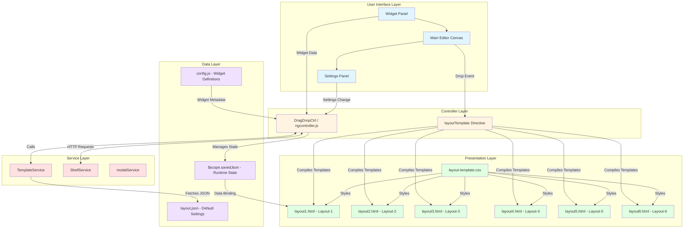

## 2. Data Flow: Widget Drop Operation

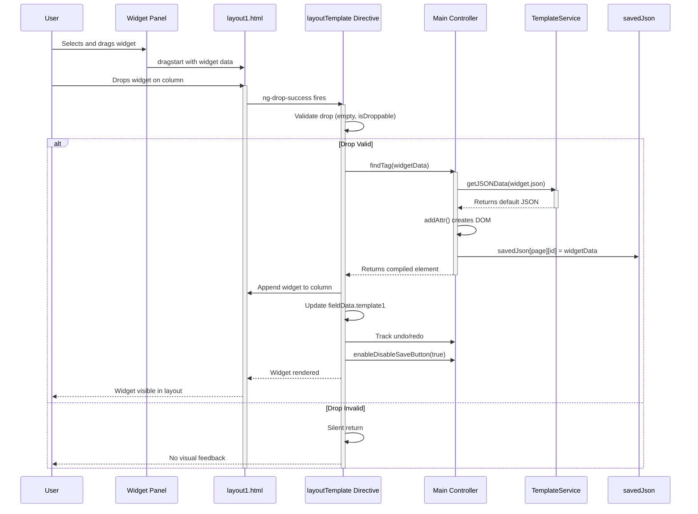

## 3. Component Lifecycle

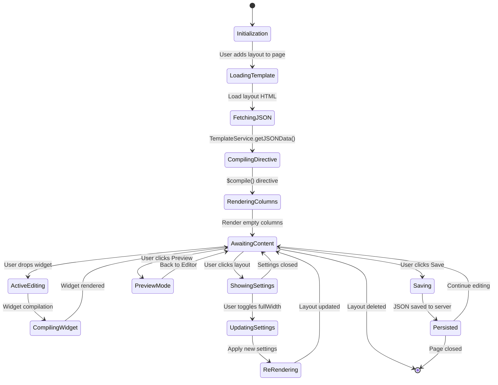

## 4. Layout-6 Question Bank Flow

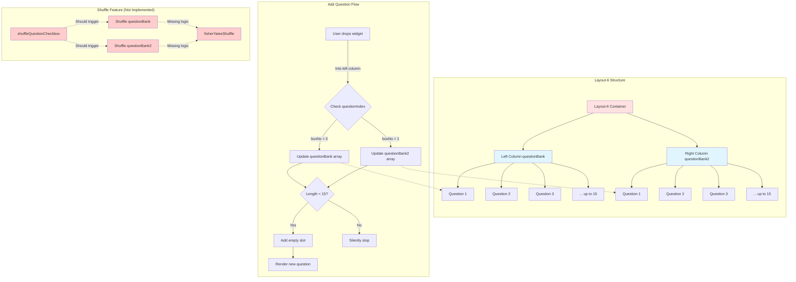

## 5. Copy-Paste Data Flow

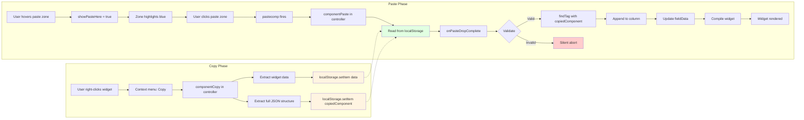

## 6. Settings Panel Integration

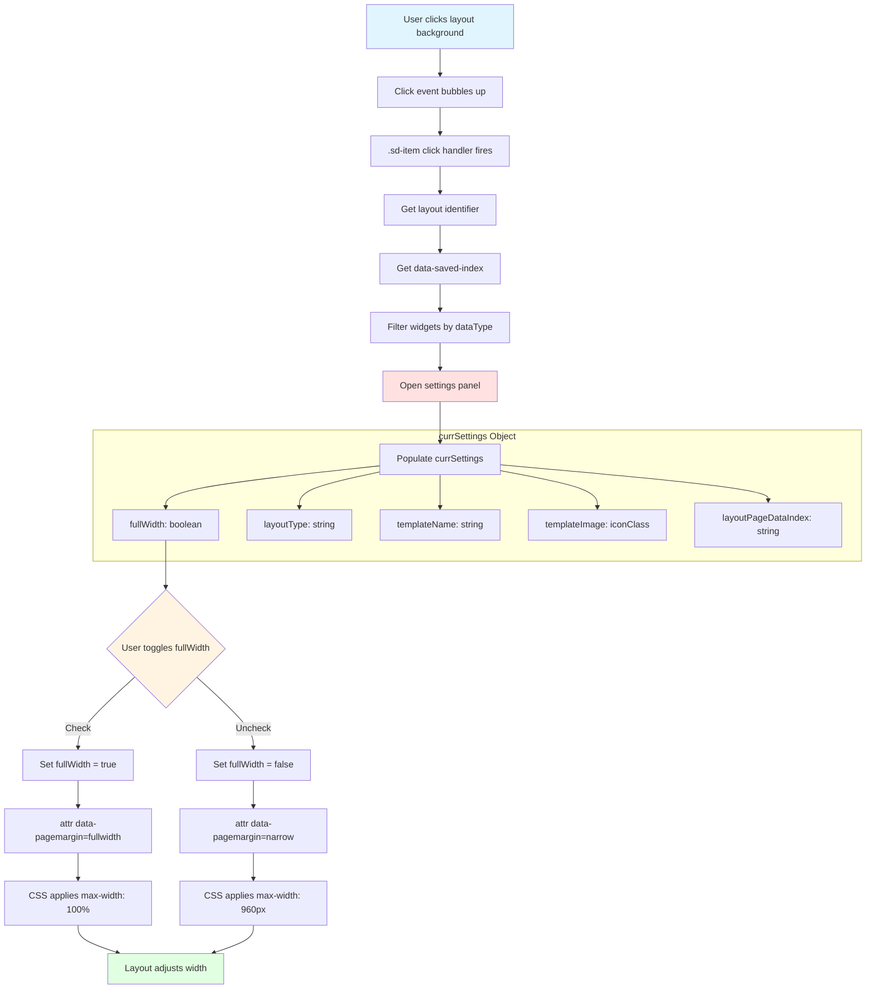

## 7. Responsive Breakpoint Logic

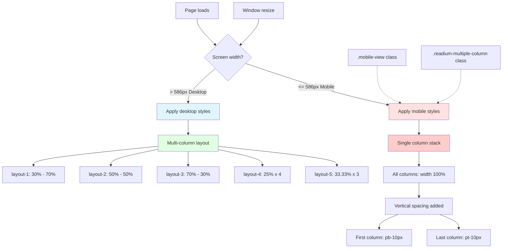

## 8. Error Handling Flow

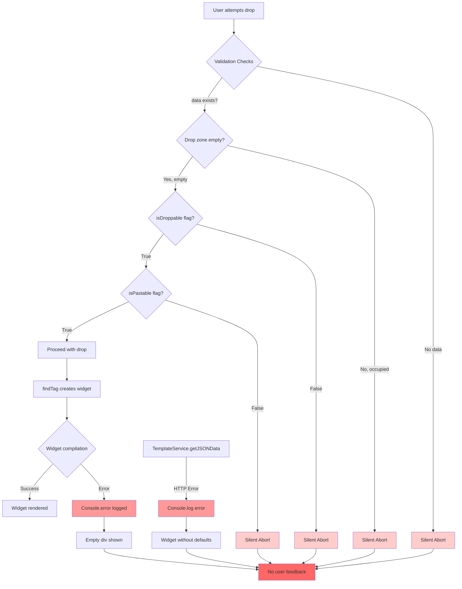

## 9. Widget Compilation Process

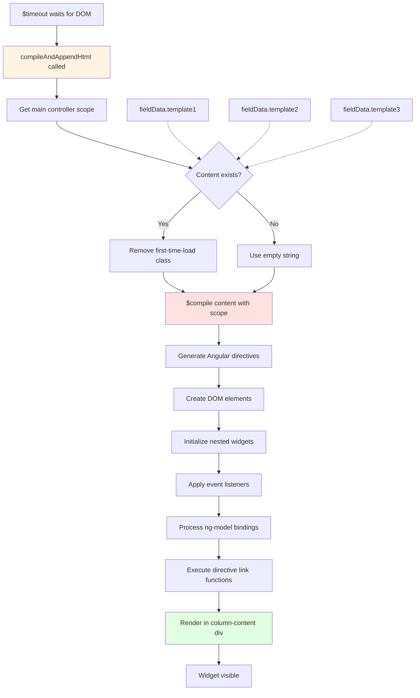

## 10. Undo/Redo Tracking

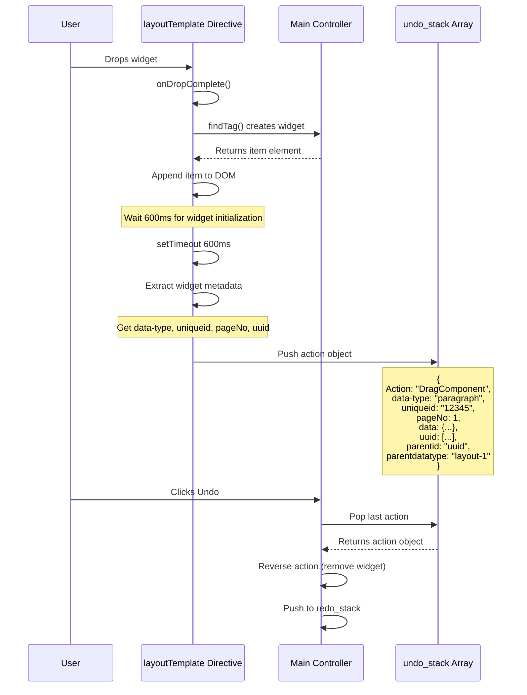

## 11. Full Width Toggle Mechanism

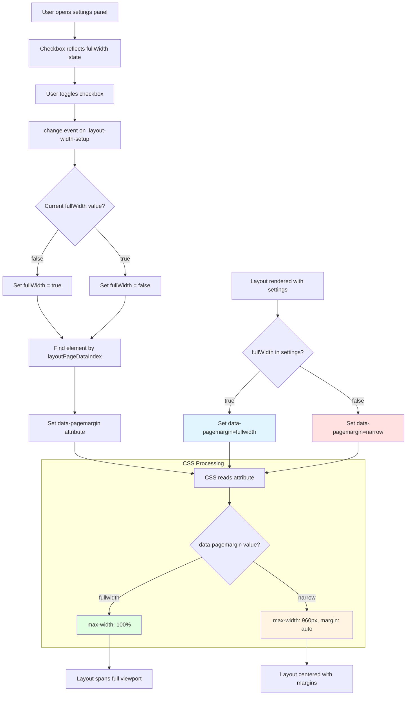

## 12. Layout Type Comparison

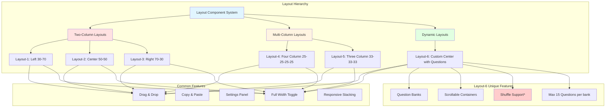

## 13. Mode-Based Rendering

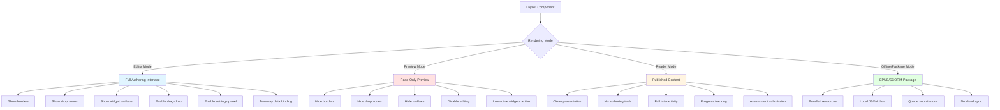

## 14. Data Persistence Flow

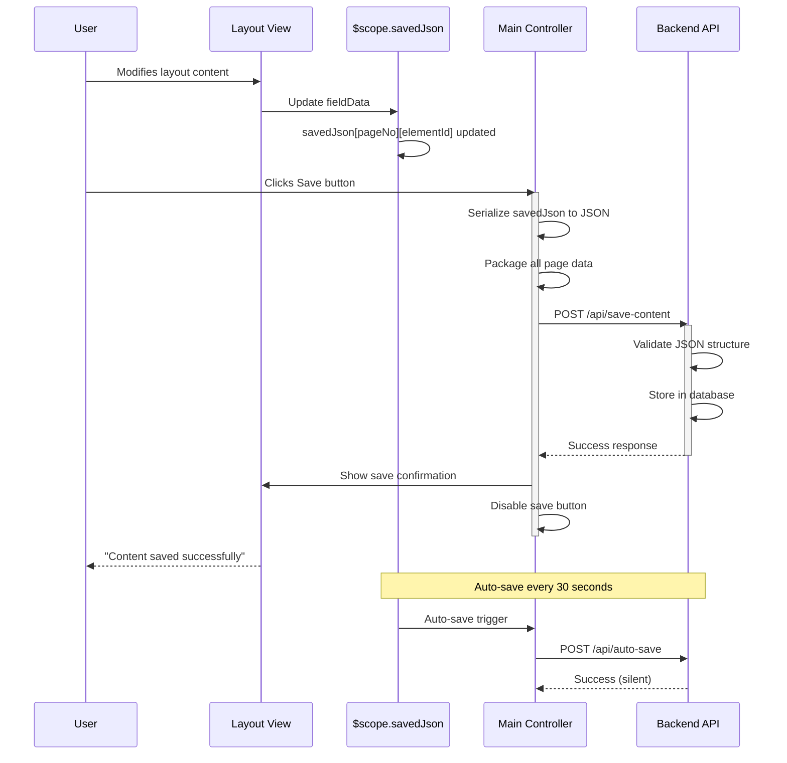

---

## Legend

### Color Coding

- **Light Blue** (#e1f5ff): User Interface / Interaction Layer
- **Light Orange** (#ffe1e1): Controller / Logic Layer  
- **Light Yellow** (#fff4e1): Service / Utility Layer
- **Light Purple** (#f0e1ff): Data / Configuration Layer
- **Light Green** (#e1ffe1): Presentation / View Layer
- **Light Red** (#ffcccc): Incomplete / Not Implemented Features
- **Red** (#ff6666): Error States / Problems

### Symbols

- **Solid Lines** (→): Active data flow / implemented functionality
- **Dashed Lines** (-.->): Planned but not implemented / optional flow
- **Boxes**: Components, modules, or states
- **Diamonds**: Decision points / conditional logic

---

## Usage Notes

These diagrams use Mermaid syntax and can be rendered in:
- GitHub markdown files
- GitLab
- Visual Studio Code (with Mermaid preview extension)
- Online tools like mermaid.live
- Documentation sites like GitBook, Docusaurus

For best viewing experience, use a Mermaid-enabled markdown viewer.

---

**Diagram Version:** 1.0  
**Companion Document:** LAYOUT_COMPONENT_TECHNICAL_DOCUMENTATION.md  
**Created:** February 17, 2026
