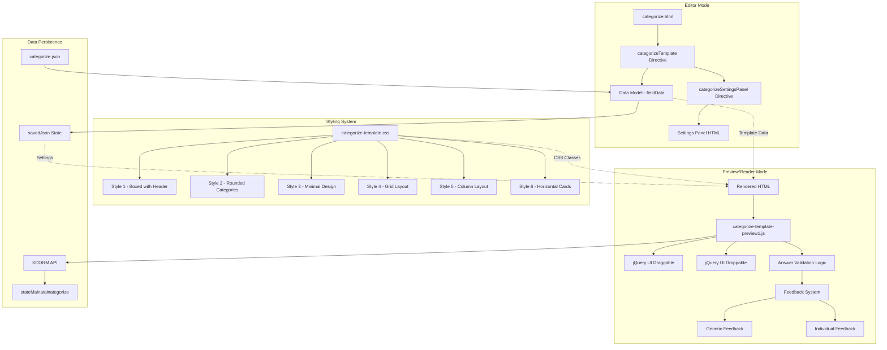
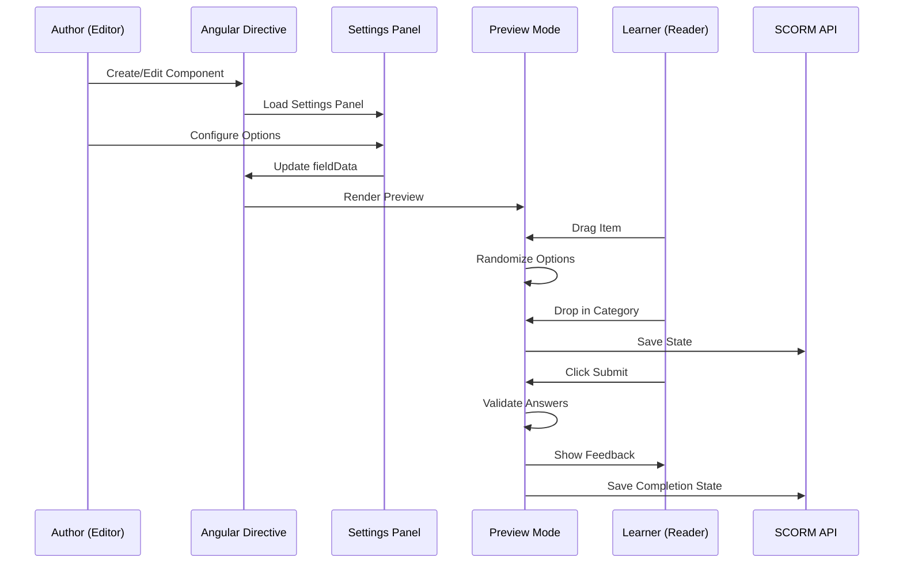
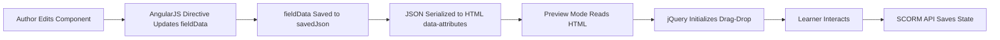
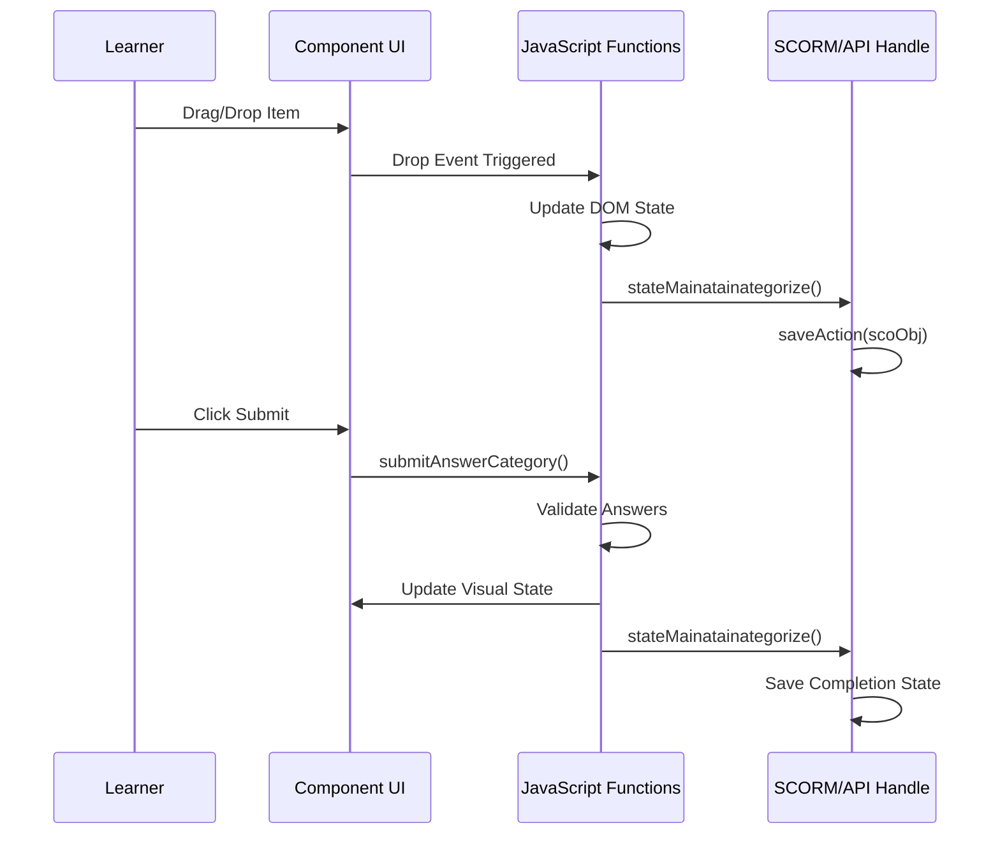

# Categorize Component - Technical Documentation

## Table of Contents
1. [Overview](#overview)
2. [Component Architecture](#component-architecture)
3. [File Structure](#file-structure)
4. [Data Model](#data-model)
5. [Style Variants](#style-variants)
6. [Editor Mode](#editor-mode)
7. [Preview/Reader Mode](#preview-reader-mode)
8. [Data Flow](#data-flow)
9. [Key Features](#key-features)
10. [Settings Configuration](#settings-configuration)
11. [Image Configuration](#image-configuration)
12. [Feedback Mechanism](#feedback-mechanism)
13. [State Management](#state-management)
14. [Known Issues & Limitations](#known-issues--limitations)
15. [Recommendations](#recommendations)

---

## Overview

The **Categorize** component is an interactive drag-and-drop assessment tool that allows learners to categorize items (text or images) into predefined categories. This component is part of the KITABOO Authoring platform and supports multiple visual styles, customizable feedback, and various configuration options.

**Primary Use Case**: Educational assessments where students need to classify items into appropriate groups/categories.

**Technology Stack**:
- AngularJS (1.x) for editor mode
- jQuery & jQuery UI for drag-and-drop functionality
- Custom CSS for styling
- SCORM API support for state persistence

---

## Component Architecture

### High-Level Architecture Diagram



### Component Interaction Flow



---

## Architectural Diagram

```
┌──────────────────────────────────────────────────────────────────────────────┐
│                         KITABOO Authoring Tool                               │
│                        (AngularJS Application)                               │
└────────────────────────────────┬─────────────────────────────────────────────┘
                                 │
                    ┌────────────┴────────────┐
                    │                         │
         ┌──────────▼──────────┐   ┌─────────▼──────────┐
         │   Editor Mode       │   │  Preview/Reader    │
         │  (Authoring)        │   │     Mode           │
         └──────────┬──────────┘   └─────────┬──────────┘
                    │                        │
         ┌──────────┴──────────┐            │
         │                     │            │
    ┌────▼────┐         ┌─────▼─────┐      │
    │  Main   │         │Categorize │      │
    │Controller│◄────────┤ Template  │      │
    │(ngCtrl) │         │ Directive │      │
    └────┬────┘         └─────┬─────┘      │
         │                    │            │
         │              ┌─────▼──────┐     │
         │              │   Scope    │     │
         │              │ Functions  │     │
         │              └─────┬──────┘     │
         │                    │            │
         ├────────────────────┼────────────┼──────────────────┐
         │                    │            │                  │
    ┌────▼────┐         ┌─────▼─────┐ ┌───▼───┐      ┌──────▼──────┐
    │ Settings│         │ Category  │ │Options│      │   Style     │
    │  Panel  │         │ Manager   │ │Manager│      │  Selection  │
    └─────────┘         └───────────┘ └───────┘      └─────────────┘
                                                           │
                                                    ┌──────▼──────┐
                                                    │  6 Style    │
                                                    │  Variants   │
                                                    └─────────────┘

         │                                              │
         └──────────────────┬───────────────────────────┘
                            │
                  ┌─────────▼──────────┐
                  │   JSON Data Model  │
                  │                    │
                  │  • fieldData       │
                  │  • settings        │
                  │  • TemplateData    │
                  │  • categories[]    │
                  │    - catTitle      │
                  │    - catItems[]    │
                  └─────────┬──────────┘
                            │
              ┌─────────────┼─────────────┐
              │                           │
     ┌────────▼────────┐         ┌────────▼────────┐
     │   localStorage  │         │  Server Storage │
     │   (Auto-save)   │         │   (Manual Save) │
     └─────────────────┘         └─────────────────┘


═══════════════════════════════════════════════════════════════════════════════
                         PREVIEW/READER MODE
═══════════════════════════════════════════════════════════════════════════════

    ┌──────────────────────────────────────────────────────────┐
    │        categorize-template-preview1.js                   │
    │              (jQuery-based)                              │
    └──────────────────┬───────────────────────────────────────┘
                       │
         ┌─────────────┼─────────────┐
         │             │             │
    ┌────▼──────┐ ┌────▼────┐ ┌─────▼──────┐
    │ jQuery UI │ │ jQuery  │ │  Option    │
    │ Draggable │ │   UI    │ │ Randomize  │
    │           │ │Droppable│ │  Handler   │
    └────┬──────┘ └────┬────┘ └─────┬──────┘
         │             │            │
         └─────────────┼────────────┘
                       │
              ┌────────▼────────┐
              │   Drop Handler  │
              │   & Validation  │
              └────────┬────────┘
                       │
         ┌─────────────┼─────────────┐
         │             │             │
    ┌────▼──────┐ ┌────▼────┐ ┌─────▼──────┐
    │  Validate │ │  Visual │ │  Feedback  │
    │  Category │ │Feedback │ │  Manager   │
    │  Match    │ │(CSS)    │ │            │
    └────┬──────┘ └────┬────┘ └─────┬──────┘
         │             │             │
         └─────────────┼─────────────┘
                       │
              ┌────────▼────────┐
              │ Attempt Manager │
              │ • Track attempts│
              │ • Show buttons  │
              │ • Final feedback│
              └────────┬────────┘
                       │
              ┌────────▼────────┐
              │  State Storage  │
              │  (SCORM/xAPI)   │
              └─────────────────┘
```

### Editor Mode Initialization Flow

```
index.html loads → AngularJS bootstrap → ngController init → 
Directive registration → Template clicked → categorizeTemplate directive link → 
Scope setup → Initialize categories (2-4) → Load saved data → 
Render items → Settings panel opened → Bind currSettings
```

### Category & Option Management Flow

```
Author opens component → Add Category (max 4) → 
Set category title (max 25 chars) → Add options to category (max 10) → 
Select option type (Text/Image) → Configure option properties → 
Set image display mode → Apply individual feedback → Toggle settings → 
Save component
```

### Student Interaction & Validation Flow

```
Student loads activity → Options randomized (if enabled) → 
Student drags item → jQuery UI detects drag start → 
Move to category drop zone → Drop zone highlights → 
Student releases → Validate category match → 
Apply visual feedback (correct/incorrect) → Store in state → 
Repeat for all items → Click Submit → Calculate score → 
Show final feedback → Report to SCORM → 
Enable/Disable buttons based on attempts
```

### Data Flow Diagram

```
┌─────────────────────────────────────────────────────────────────┐
│                        EDITOR MODE                              │
│                                                                 │
│  Author Input → AngularJS Binding → JSON Model Update →        │
│  Settings Panel → fieldData.settings → Template Re-render       │
│                                                                 │
│  Category Management:                                           │
│  ┌──────────────────────────────────────────────────────┐     │
│  │ Add/Delete → categories[] array → Compile HTML →     │     │
│  │ DOM Update → Save to JSON                            │     │
│  └──────────────────────────────────────────────────────┘     │
│                                                                 │
│  Option Management:                                             │
│  ┌──────────────────────────────────────────────────────┐     │
│  │ Add/Delete → catItems[] array → Update indices →     │     │
│  │ Re-render → Validate constraints (max 10)            │     │
│  └──────────────────────────────────────────────────────┘     │
└─────────────────────────────────────────────────────────────────┘
                             ▼
┌─────────────────────────────────────────────────────────────────┐
│                    PREVIEW/READER MODE                          │
│                                                                 │
│  Page Load → Parse JSON → Render categories & options →        │
│  Initialize jQuery UI → Apply style CSS → Randomize (optional) │
│                                                                 │
│  Student Interaction:                                           │
│  ┌──────────────────────────────────────────────────────┐     │
│  │ Drag Start → jQuery UI draggable → Move to zone →    │     │
│  │ Drop Event → Validate match → Apply feedback →       │     │
│  │ Update attempt counter → Store state                 │     │
│  └──────────────────────────────────────────────────────┘     │
│                                                                 │
│  Submit Action:                                                 │
│  ┌──────────────────────────────────────────────────────┐     │
│  │ Count correct items → Calculate percentage →         │     │
│  │ Show feedback message → Report to SCORM →            │     │
│  │ Disable/Enable buttons → Update UI state             │     │
│  └──────────────────────────────────────────────────────┘     │
└─────────────────────────────────────────────────────────────────┘
```

### Style Variant Architecture

```
┌──────────────────────────────────────────────────────────────────┐
│                    CATEGORIZE STYLE SYSTEM                       │
└──────────────────────────────────────────────────────────────────┘

┌─────────────────┐  ┌─────────────────┐  ┌─────────────────┐
│   Style 1       │  │   Style 2       │  │   Style 3       │
│ Boxed w/Header  │  │  Rounded Cats   │  │   Minimal       │
├─────────────────┤  ├─────────────────┤  ├─────────────────┤
│ ┌─────────────┐ │  │ ◄ Category A ►  │  │  Category A     │
│ │ Category A  │ │  │ ┌─────────────┐ │  │  • Option 1     │
│ ├─────────────┤ │  │ │  Option 1   │ │  │  • Option 2     │
│ │  Option 1   │ │  │ │  Option 2   │ │  │                 │
│ │  Option 2   │ │  │ └─────────────┘ │  │  Category B     │
│ └─────────────┘ │  │                 │  │  • Option 3     │
└─────────────────┘  └─────────────────┘  └─────────────────┘

┌─────────────────┐  ┌─────────────────┐  ┌─────────────────┐
│   Style 4       │  │   Style 5       │  │   Style 6       │
│  Grid Layout    │  │Column Layout    │  │ Horizontal Cards│
├─────────────────┤  ├─────────────────┤  ├─────────────────┤
│ ┌──────┬──────┐ │  │ │Category A │   │  │ ╔═══════╗ ╔═══╗│
│ │Cat A │Cat B │ │  │ │• Option 1 │   │  │ ║ Cat A ║ ║ B ║│
│ │Opt 1 │Opt 3 │ │  │ │• Option 2 │   │  │ ╠═══════╣ ╠═══╣│
│ │Opt 2 │Opt 4 │ │  │ │           │   │  │ ║ Opt 1 ║ ║Opt║│
│ └──────┴──────┘ │  │ │Category B │   │  │ ║ Opt 2 ║ ║ 3 ║│
│                 │  │ │• Option 3 │   │  │ ╚═══════╝ ╚═══╝│
└─────────────────┘  └─────────────────┘  └─────────────────┘

CSS Class Application:
.categorize-styleX → Applied to component wrapper → 
Style-specific selectors → Layout & appearance rules → 
Responsive adjustments
```

---

## File Structure

### Core Files

| File | Purpose | Lines | Key Responsibilities |
|------|---------|-------|---------------------|
| **categorize.html** | Main template | 200 | HTML structure for editor mode, defines editable areas |
| **categorize-template-directive.js** | Editor directive | 381 | AngularJS logic for authoring, settings binding, event handling |
| **categorize-template-preview1.js** | Preview/Reader script | 448 | Drag-drop functionality, answer validation, state persistence |
| **categorize-template.css** | Styling | 861 | 6 style variants, responsive design, visual states |
| **categorize-settings-panel.html** | Settings UI | 206 | Configuration panel for authors |
| **categorize.json** | Default data | 126 | Default structure and settings |

### Directory Structure
```
templates/categorize/
├── categorize.html                      # Main template
├── categorize-settings-panel.html       # Settings panel
├── scripts/
│   ├── categorize-template-directive.js # Editor logic
│   └── categorize-template-preview1.js  # Preview/Reader logic
├── styles/
│   ├── categorize-template.css          # Component styles
│   └── images/
│       └── Drag.png                     # Drag icon
└── default/
    └── categorize.json                  # Default configuration
```

---

## Data Model

### Main Data Structure (fieldData)

```javascript
{
  "identifier": "categorize",
  "question": "Question 1",              // Primary label
  "secondaryQuestion": "Part A",         // Secondary label
  
  "settings": {
    "isLabelTypeCategorize": false,      // Show label type selector
    "labelType": "primary",              // "primary" | "secondary"
    "maxTries": "3",                     // Number of attempts (1-5)
    "isHeaderVisible": true,             // Show/hide header
    "isInstructionVisible": true,        // Show/hide instructions
    "isQuestionVisible": true,           // Show/hide question
    "allowRestart": false,               // Enable "Try Again"
    "showmecheckbox": false,             // Enable "Show Me"
    "reset": true,                       // Enable "Reset"
    "outline": "outline",                // "outline" | "outlineBg"
    "Appearance": "#113e9a",             // Primary color
    "BgAppearance": "rgb(126,177,235,0.3)",
    "genericFeedbackCheckbox": false,    // Enable generic feedback
    "generic_correct_ans_text": "",      // Custom correct message
    "generic_incorrect_ans_text": "",    // Custom incorrect message
    "individualfeedback": false,         // Per-option feedback
    "selected_style": "categorize-style1",// Active style variant
    "templateName": "Categorize",
    "activeOption": {},                  // Currently selected option
    "activeOptionIndex": 0,              // Active option index
    "showBlanksettings": false,          // Show option properties panel
    "style_tab": [...]                   // Available style variants
  },
  
  "TemplateData": {
    "headerText": "",                    // Header text
    "instructionText": "",               // Instruction text
    "questionText": "",                  // Question text
    "categories": [                      // Array of categories (2-4)
      {
        "catTitle": "",                  // Category name (max 25 chars)
        "catItems": [],                  // Array of items (0-10)
        "imageConfiguration": {
          "imageDisplayMode": "default-img",  // "default-img" | "large-img"
          "imageRatio": "original-ratio",     // "original-ratio" | "custom-ratio"
          "imageCustomWidth": "",             // Custom width in px
          "imageCustomHeight": ""             // Custom height in px
        }
      }
    ]
  }
}
```

### Category Item Structure

```javascript
{
  "catOptiontype": "text",               // "text" | "image"
  "catText": "",                         // Text content (max 150 chars)
  "imageSrc": "images/image.jpg",        // Image source
  "imgName": "",                         // Image filename
  "imageUploadOrReplace": "Upload",      // "Upload" | "Replace"
  "correctFeedback": "",                 // Correct feedback message
  "incorrectFeedback": ""                // Incorrect feedback message
}
```

---

## Style Variants

The component supports **6 distinct visual styles**, each with unique layout and presentation characteristics.

### Available Styles

| Style | Name | Description | Key Features |
|-------|------|-------------|--------------|
| **Style 1** | Boxed with Header | Categories with colored headers | Colored category headers, bordered boxes, clear separation |
| **Style 2** | Rounded Categories | Rounded header badges | Pill-shaped category names, contained drop zones with borders |
| **Style 3** | Minimal Design | Clean, borderless | Text-only category headers, minimal visual elements |
| **Style 4** | Grid Layout | Organized grid | Side-by-side categories in grid format |
| **Style 5** | Column Layout | Vertical columns | Categories displayed as columns, similar to Style 2 |
| **Style 6** | Horizontal Cards | Horizontal layout | Categories arranged horizontally with card-style options |

### Style Implementation

Each style is implemented through CSS class selectors:
```css
.categorize-style1 { /* Boxed with Header styles */ }
.categorize-style2 { /* Rounded Categories styles */ }
.categorize-style3 { /* Minimal Design styles */ }
.categorize-style4 { /* Grid Layout styles */ }
.categorize-style5 { /* Column Layout styles */ }
.categorize-style6 { /* Horizontal Cards styles */ }
```

### Style-Specific Behaviors

- **Styles 3 & 5**: Use color-only category headers (text color instead of background)
- **Styles 2 & 5**: Position categories in vertical columns with flexbox
- **Style 4**: Uses CSS Grid for organized layout
- **All styles**: Support both text and image options with responsive design

---

## Editor Mode

### Component Directive: `categorizeTemplate`

**File**: `categorize-template-directive.js`

**Purpose**: Provides authoring functionality in the KITABOO editor.

### Key Functions

#### 1. Category Management
```javascript
// Add new category (max 4)
addCategory(event) {
  if (categories.length < 4) {
    categories.push({
      "catTitle": "",
      "catItems": [],
      "imageConfiguration": { /* default config */ }
    });
  }
}

// Delete category (min 2)
deleteCategory(index) {
  if (categories.length > 2) {
    categories.splice(index, 1);
  }
}
```

#### 2. Option Management
```javascript
// Add option to category (max 10)
addCategoryOptions(catId) {
  if (categories[catId].catItems.length < 10) {
    categories[catId].catItems.push({
      "catOptiontype": "text",
      "catText": "",
      // ... other properties
    });
  }
}

// Delete option
deleteCategoryOptions(catInx, optInx) {
  categories[catInx].catItems.splice(optInx, 1);
}
```

#### 3. Text Validation
```javascript
// Category name: max 25 characters
handleMaxLengthOnCategoryName($event, index)

// Option text: max 150 characters
keyupOptionText(evt, catInx, optInx)
```

#### 4. Active State Management
```javascript
// Set active category for styling
setActiveCategory(evt) {
  $('.categoryActive').removeClass("categoryActive");
  $(evt.target).closest('.categories').addClass('categoryActive');
}

// Set active option for property editing
setActiveOption(evt, option, index) {
  fieldData.settings.activeOption = option;
  fieldData.settings.activeOptionIndex = index;
  fieldData.settings.showBlanksettings = true;
}
```

### Settings Panel Directive: `categorizeSettingsPanel`

**File**: `categorize-template-directive.js` (lines 241-381)

**Purpose**: Manages settings UI and configuration updates.

#### Key Settings Functions

```javascript
// Color change handler
colorchangeCategorize(value) {
  // Updates category header background color
  // Calculates RGBA variants for hover states
  // Applies to all categories
}

// Image mode change
catOptionImageModeChange(value) {
  // Switches between "default-img" and "large-img"
}

// Custom dimensions handler
onCustomDimensionChange() {
  // Updates image dimensions when custom ratio is selected
  // Enforces minimum 1px for width and height
}

// Try Again attempts validation
isWithinTryAgainRange(event) {
  // Restricts input to 1-5 range
  // Supports arrow keys for increment/decrement
}
```

### Editable Fields

All content fields are `contenteditable` with:
- **Math support**: `.math-read-only-field` class
- **Character limits**: Enforced via `ng-keydown` and `ng-paste` handlers
- **Placeholder text**: Native HTML5 placeholder attribute
- **AngularJS binding**: Two-way data binding via `ng-model`

---

## Preview/Reader Mode

### Initialization Script: `categorize-template-preview1.js`

**File**: `categorize-template-preview1.js`

**Purpose**: Handles learner interactions, drag-drop functionality, and answer validation.

### Initialization Sequence

```javascript
$(function() {
  // 1. Setup data-attributes for tracking
  $('.categories').each(function(index) {
    $(this).attr('data-cat-index', index);
    $(this).find('.cat_Options').each(function(inx) {
      // Assign data-ans-index and data-id for validation
    });
  });
  
  // 2. Randomize options (Fisher-Yates algorithm)
  var divs = $('.cat_Options');
  // Shuffle algorithm...
  // Append to drag-drop-container
  
  // 3. Initialize jQuery UI Draggable
  $('.cat_Options').draggable({
    cursor: "move",
    revert: "invalid",
    helper: 'clone',
    appendTo: 'body'
  });
  
  // 4. Initialize jQuery UI Droppable
  $('.options_div').droppable({
    accept: ".categorize-drag-drop-container .cat_Options",
    drop: function(event, ui) {
      // Handle drop logic
    }
  });
});
```

### Drag and Drop Mechanism

#### Draggable Configuration
```javascript
$('.cat_Options').draggable({
  cursor: "move",
  revert: "invalid",          // Return to original position if not dropped
  helper: 'clone',            // Clone the element while dragging
  appendTo: 'body',           // Append helper to body for z-index
  start: function(event, ui) {
    // Adjust cursorAt position dynamically
    // Set helper width
  }
});
```

#### Droppable Configuration
```javascript
$('.options_div').droppable({
  accept: ".categorize-drag-drop-container .cat_Options",
  activeClass: "greedy",      // Class when dragging starts
  hoverClass: "ui-state-active", // Class when hovering over drop zone
  drop: function(event, ui) {
    // Clone draggable to droppable
    $(ui.draggable).clone().appendTo($(this));
    
    // Disable original draggable
    $(ui.draggable).draggable({ disabled: true });
    $(ui.draggable).addClass('added ui-draggable-disabled');
    
    // Enable submit if all items dropped
    if ($form.find('.categorize-drag-drop-container .ui-draggable').length == 0) {
      $form.find('.submit-btn').removeClass('disabled');
    }
    
    // Save state to SCORM
    stateMainatainategorize(event);
  }
});
```

#### Click-to-Place Alternative
For accessibility and mobile support, learners can also:
1. Click an option to select it (adds `.optionSelected` class)
2. Click a category drop zone
3. Option is placed in that category

```javascript
$(document).on('click', '.categories .options_div', function(event) {
  var draggable = $(".optionSelected")[0];
  if (draggable && $(event.target).hasClass('options_div')) {
    // Clone and place option
    // Disable original
    // Update UI state
  }
});
```

### Answer Validation

#### Submit Answer Function
```javascript
function submitAnswerCategory(event) {
  // 1. Increment attempt counter
  var attempts = $(event.target).attr('data-attempts');
  attempts++;
  
  // 2. Check each dropped option
  $form.find('.categories').each(function(index) {
    var categoryIndex = $(this).attr("data-cat-index");
    $(this).find('.cat_single_option').each(function() {
      if ($(this).attr("data-ans-index") == categoryIndex) {
        // CORRECT: Add checkmark, show correct feedback
        $(this).addClass('ans_correct');
        $(this).append('<i class="icon-correct"></i>');
      } else {
        // INCORRECT: Add X, show incorrect feedback
        $(this).addClass('ans_incorrect');
        $(this).append('<i class="icon-close-filled"></i>');
      }
    });
  });
  
  // 3. Determine overall result
  var totalAnswer = $form.find('.cat_single_option').length;
  var correctCount = $form.find('.ans_correct').length;
  var incorrectCount = $form.find('.ans_incorrect').length;
  
  if (incorrectCount == totalAnswer) {
    // All incorrect
    $form.find('.categories-container').addClass('isInCorrect');
  } else if (correctCount == totalAnswer) {
    // All correct
    $form.find('.categories-container').addClass('isCorrect');
  } else {
    // Partially correct
    $form.find('.categories-container').addClass('isPartialCorrect');
  }
  
  // 4. Show generic feedback if enabled
  if (genericFeedbackEnable) {
    categorizeAlert.show(/* message */);
  }
  
  // 5. Save state
  stateMainatainategorize(event);
}
```

### Button Actions

#### Try Again
```javascript
function tryagainCategory(event) {
  // 1. Re-enable all draggable options
  $form.find('.categorize-drag-drop-container .cat_Options').each(function() {
    $(this).draggable('enable');
    $(this).removeClass('added ui-draggable-disabled ui-state-disabled');
  });
  
  // 2. Remove dropped options from categories
  $form.find('.categories .cat_Options').remove();
  
  // 3. Reset UI state
  $form.find('.categories-container').removeClass('isInCorrect isCorrect isPartialCorrect');
  
  // 4. Hide feedback
  $form.find(".categorize-alert").hide();
  
  // 5. Update buttons
  $form.find('.submit-btn').addClass('disabled');
  $form.find('.tryagn-btn').addClass('disabled');
}
```

#### Reset
```javascript
function resetAnswerCategory(event) {
  // Similar to Try Again but doesn't increment attempts
  // Returns component to initial state
}
```

#### Show Me
```javascript
function showAnswerCategory(event) {
  // 1. Clear all categories
  $form.find('.categories .cat_Options').remove();
  
  // 2. Place all options in correct categories
  $form.find('.categories').each(function(index) {
    var categoryIndex = $(this).attr("data-cat-index");
    var droppable = $(this).find('.options_div');
    
    $form.find('.categorize-drag-drop-container .cat_Options').each(function() {
      if ($(this).find('.cat_single_option').attr("data-ans-index") == categoryIndex) {
        // Clone to correct category
        $(this).clone().appendTo(droppable);
        $(this).draggable({ disabled: true });
      }
    });
  });
  
  // 3. Mark all as correct
  $form.find('.cat_single_option').addClass('ans_correct');
  $form.find('.cat_single_option').append('<i class="icon-correct"></i>');
  
  // 4. Disable all buttons except restart (if enabled)
  $form.find('.submit-btn, .showme-btn, .reset-btn, .tryagn-btn').addClass('disabled');
}
```

---

## Data Flow

### Editor to Preview Flow



### State Persistence Flow



### State Object Structure (scoObj)

```javascript
{
  "isSubmitEnable": boolean,        // Submit button state
  "isShowMeEnable": boolean,        // Show Me button state
  "isTryAgainEnable": boolean,      // Try Again button state
  "isResetEnable": boolean,         // Reset button state
  "totalNoOfAttempt": number,       // Max attempts allowed
  "attemptsDone": number,           // Attempts completed
  "feedbackMessage": {
    "enable": boolean,              // Is feedback visible
    "symbol": string,               // "Correct!" | "Incorrect!"
    "message": string               // Feedback text
  },
  "isIndFeedbackEnable": boolean,   // Individual feedback visible
  "inputSeleced": array,            // ["catIndex-optionId", ...]
  "inputCorrect": array,            // Correct placements
  "inputIncorrect": array,          // Incorrect placements
  "dataType": "Categorize",
  "componentId": string             // Component unique ID
}
```

---

## Key Features

### 1. Drag and Drop
- **Library**: jQuery UI Draggable/Droppable
- **Animation**: Helper clone, smooth revert
- **Accessibility**: Click-to-place alternative
- **Visual Feedback**: Hover states, active highlighting

### 2. Option Randomization
- **Algorithm**: Fisher-Yates shuffle
- **Timing**: On component load in preview mode
- **Purpose**: Prevents memorization, ensures fair assessment

### 3. Flexible Option Types
- **Text Options**: Rich text support with math rendering
- **Image Options**: Multiple display modes (default, large, custom)
- **Mixed Mode**: Categories can contain both text and images

### 4. Attempt Tracking
- **Range**: 1-5 attempts
- **Behavior**: 
  - Submit disabled until all items placed
  - Try Again enabled after submission (if attempts remain)
  - Show Me option available if configured

### 5. Feedback System
- **Generic Feedback**: Overall correct/incorrect message
- **Individual Feedback**: Per-option correctness indicators
- **Visual States**: Color-coded borders, icons (checkmark/X)

### 6. Responsive Design
- **Mobile Support**: Touch-punch plugin for touch events
- **Breakpoints**: Defined in CSS for different screen sizes
- **Adaptive Layout**: Styles adjust based on viewport

### 7. Math Rendering
- **Support**: MathML/LaTeX via `.math-read-only-field` class
- **Areas**: Header, instruction, question, options
- **Integration**: Temml-Local.css for rendering

### 8. Group Activity Integration
- **Detection**: `isGroupActivity` flag in settings
- **Behavior**: Certain settings hidden in group context
- **Compatibility**: Works within group-interactivity-template

---

## Settings Configuration

### Visibility Settings

| Setting | Property | Default | Description |
|---------|----------|---------|-------------|
| Show Header | `isHeaderVisible` | `true` | Display header text section |
| Show Instruction | `isInstructionVisible` | `true` | Display instruction text section |
| Show Question | `isQuestionVisible` | `true` | Display question text section |
| Show Label Type | `isLabelTypeCategorize` | `false` | Enable primary/secondary question labels |

### Visual Settings

| Setting | Property | Values | Description |
|---------|----------|--------|-------------|
| Style Options | `selected_style` | `categorize-style1` to `categorize-style6` | Visual design variant |
| Outline | `outline` | `"outline"` \| `"outlineBg"` | Component border style |
| Action Assets | `Appearance` | Color hex | Primary color for headers, buttons |

### Interaction Settings

| Setting | Property | Range | Description |
|---------|----------|-------|-------------|
| Try Again | `allowRestart` | boolean | Enable retry functionality |
| No. of Attempts | `maxTries` | 1-5 | Maximum submission attempts |
| Add Show Me | `showmecheckbox` | boolean | Enable answer reveal |
| Reset | `reset` | boolean | Enable reset button |

### Feedback Settings

| Setting | Property | Type | Description |
|---------|----------|------|-------------|
| Generic Feedback | `genericFeedbackCheckbox` | boolean | Show overall feedback message |
| Correct Feedback | `generic_correct_ans_text` | string | Custom correct message |
| Incorrect Feedback | `generic_incorrect_ans_text` | string | Custom incorrect message |
| Individual Feedback | `individualfeedback` | boolean | Per-option feedback messages |

---

## Image Configuration

### Display Modes

#### Default Image Mode (`default-img`)
- **Max Height**: 80px
- **Object Fit**: Contain
- **Behavior**: Maintains aspect ratio, centers in container

#### Large Image Mode (`large-img`)
- **Max Height**: 300px
- **Aspect Ratio**: 1:1
- **Object Fit**: Contain
- **Behavior**: Larger display, suitable for detailed images

#### Custom Ratio Mode (`custom-ratio`)
- **Width**: User-defined (min 1px)
- **Height**: User-defined (min 1px)
- **Behavior**: Fixed dimensions, may not preserve aspect ratio

### Image Configuration Per Category

```javascript
"imageConfiguration": {
  "imageDisplayMode": "default-img",    // Mode selector
  "imageRatio": "original-ratio",       // Ratio type
  "imageCustomWidth": "",               // Custom width (if custom-ratio)
  "imageCustomHeight": ""               // Custom height (if custom-ratio)
}
```

**Note**: Image configuration is **per-category**, meaning all images in a category share the same display settings.

### Settings Panel Logic

```javascript
// Initialize custom dimensions when switching to custom ratio
initCustomRatioDims() {
  // Reads current image natural dimensions
  // Sets as initial custom dimensions
  // Applies to all images in category
}

// Update dimensions on change
onCustomDimensionChange() {
  // Enforces minimum 1px
  // Applies inline styles to images
  // Updates all images in active category
}
```

---

## Feedback Mechanism

### Generic Feedback

**Display**: Alert box at bottom of component

**Structure**:
```html
<div class="categorize-alert">
  <div class="categorize-alert-container">
    <span class="categorize-alert-icon icon-correct"></span>
    <span class="categorize-alert-message">Message text</span>
  </div>
</div>
```

**Behavior**:
- Shown after submission
- Icon changes based on result (checkmark/X)
- Message from settings or default text
- Dismisses on Try Again/Reset

**Default Messages**:
- **Correct**: "Congratulations! Your answer is correct"
- **Incorrect**: "Oops! You have selected the wrong answer"

### Individual Feedback

**Display**: Below each option

**Structure**:
```html
<div class="categoryFeedback">
  <div class="correct">Correct: <div class="feedbackmsg">Message</div></div>
  <div class="incorrect">Incorrect: <div class="feedbackmsg">Message</div></div>
</div>
```

**Behavior**:
- Hidden until submission
- Shows appropriate message based on correctness
- Hides opposite message (if correct, hide incorrect)
- Per-option customization in editor

---

## State Management

### SCORM Integration

**Function**: `stateMainatainategorize(event)`

**Purpose**: Persists learner progress and answers to LMS

**Trigger Points**:
- Item dropped in category
- Submit button clicked
- Try Again clicked
- Reset clicked
- Show Me clicked

### State Data Captured

```javascript
{
  // Button states
  isSubmitEnable: !$('.submit-btn').hasClass('disabled'),
  isShowMeEnable: !$('.showme-btn').hasClass('disabled'),
  isTryAgainEnable: !$('.tryagn-btn').hasClass('disabled'),
  isResetEnable: !$('.reset-btn').hasClass('disabled'),
  
  // Progress tracking
  totalNoOfAttempt: maxTries,
  attemptsDone: currentAttempts,
  
  // Answer data
  inputSeleced: ["0-00", "1-10", ...],  // catIndex-optionId
  inputCorrect: ["0-00", ...],
  inputIncorrect: ["1-10", ...],
  
  // Feedback state
  feedbackMessage: {
    enable: true/false,
    symbol: "Correct!" | "Incorrect!",
    message: "Feedback text"
  },
  isIndFeedbackEnable: true/false,
  
  // Component metadata
  dataType: "Categorize",
  componentId: uniqueId
}
```

### Activity In Progress

**Detection**: `window.isActivityInprogress`

**Behavior**:
```javascript
if (window.isActivityInprogress) {
  $form.find('.cat_Options').addClass('disabledInput');
}
```

**Purpose**: Prevents interaction if activity is locked/completed

### Latency Tracking

**Purpose**: Measure time from first interaction to submission

**Implementation**:
```javascript
if (!$form.parents('.customClass').attr('latencyTime')) {
  let d = new Date();
  let tm = d.getHours() + ":" + d.getMinutes() + ":" + d.getSeconds();
  $form.parents('.customClass').attr('latencyTime', tm);
}
```

**Stored in**: `latencyTime` attribute on component container

---

## Known Issues & Limitations

### 1. Character Limits

**Issue**: Text length restrictions may truncate content

**Limitations**:
- Category Name: **25 characters**
- Option Text: **150 characters**

**Recommendation**: Provide clear guidance to authors about limits in UI

### 2. Category and Option Limits

**Issue**: Fixed min/max constraints

**Constraints**:
- Categories: **Min 2**, **Max 4**
- Options per Category: **Min 0**, **Max 10**

**Impact**: Cannot create more complex categorization activities

**Recommendation**: Consider making these configurable in settings

### 3. Image Configuration Scope

**Issue**: Image settings apply to entire category, not individual images

**Impact**: 
- All images in a category must use same display mode
- Cannot mix default and large images within one category

**Recommendation**: Move image configuration to option level for flexibility

### 4. Drag-Drop on Mobile

**Issue**: jQuery UI drag-drop requires touch-punch plugin

**Current Solution**: `jquery.ui.touch-punch.js` included

**Limitation**: Touch interactions may not be as smooth as native mobile gestures

**Recommendation**: Consider implementing native touch events or modern drag-drop API

### 5. State Restoration

**Issue**: Code shows state save but no explicit restore logic in provided files

**Gap**: `stateMainatainategorize()` calls `saveAction()` but restore logic not visible

**Recommendation**: Document state restoration process or implement clear restore function

### 6. Randomization Consistency

**Issue**: Fisher-Yates shuffle runs on every page load

**Problem**: In a resumed activity, order changes each time

**Expected**: Maintain original shuffle order from first attempt

**Recommendation**: Save shuffled order in state and restore on reload

### 7. Math Rendering Dependencies

**Issue**: Math fields marked with `.math-read-only-field` but rendering logic external

**Dependency**: Relies on Temml-Local.css and external initialization

**Risk**: Math may not render if scripts not loaded in correct order

**Recommendation**: Document math rendering initialization sequence

### 8. Accessibility

**Issue**: Limited ARIA attributes and keyboard navigation

**Observations**:
- Drag-drop not fully keyboard accessible (though click-to-place helps)
- No ARIA labels on dynamic feedback elements
- Focus management not handled after drag-drop

**Recommendation**: Enhance ARIA attributes, keyboard navigation, and screen reader support

### 9. Generic Feedback Localization

**Issue**: Hardcoded default messages in English

**Current**:
```javascript
var genericCorrectFeedback = "Congratulations! Your answer is correct";
var genericIncorrectFeedback = "Oops! You have selected the wrong answer";
```

**Partial Solution**: Code checks `window.localeJson` but not consistently applied

**Recommendation**: Fully implement i18n system for all user-facing strings

### 10. Browser Compatibility

**Issue**: Heavy reliance on jQuery UI (older library)

**Concerns**:
- jQuery UI is no longer actively maintained
- Modern browsers may deprecate features used

**Recommendation**: Plan migration to modern drag-drop API or libraries like interact.js

### 11. Performance with Large Option Sets

**Issue**: 4 categories × 10 options = 40 draggable elements

**Risk**: DOM manipulation and event listeners may cause lag on low-end devices

**Recommendation**: Implement virtual scrolling or lazy rendering for large sets

### 12. Style Switching

**Issue**: Style changes in settings panel but may require component reload

**Observation**: `categorizeApplyStyle()` only updates settings, not live preview

**Recommendation**: Implement live style preview in settings panel

---

## Recommendations

### High Priority

#### 1. State Restoration Implementation
**Current**: State save exists, restore unclear  
**Action**: Implement explicit `restoreCategorizeState(scoObj)` function  
**Benefit**: Learners can resume interrupted activities

#### 2. Accessibility Enhancements
**Current**: Limited keyboard navigation and ARIA support  
**Action**:
- Add ARIA labels to categories and options
- Implement keyboard shortcuts for drop actions
- Add focus indicators and management
- Provide skip-to-answer link

**Benefit**: Inclusive learning experience, WCAG compliance

#### 3. Shuffle Order Persistence
**Current**: Re-randomizes on every load  
**Action**: Save shuffle order in state, restore on subsequent loads  
**Benefit**: Consistent experience for learners reviewing attempts

### Medium Priority

#### 4. Flexible Limits
**Current**: Hardcoded 2-4 categories, 0-10 options  
**Action**: Make limits configurable in settings panel  
**Benefit**: Support more diverse use cases

#### 5. Per-Option Image Configuration
**Current**: Image settings at category level  
**Action**: Move configuration to option level  
**Benefit**: Mixed image sizes within categories

#### 6. Modernize Drag-Drop
**Current**: jQuery UI (maintenance mode)  
**Action**: Migrate to HTML5 Drag-Drop API or interact.js  
**Benefit**: Better performance, future-proof, reduced dependencies

#### 7. Enhanced Feedback Options
**Current**: Binary correct/incorrect feedback  
**Action**:
- Add partial credit scoring
- Support custom feedback per category
- Add feedback delay/animation options

**Benefit**: More nuanced assessment and engagement

#### 8. Live Style Preview
**Current**: Style changes require reinitialization  
**Action**: Update component styles dynamically in editor  
**Benefit**: Better authoring experience

### Low Priority

#### 9. Extended Character Limits
**Current**: 25 chars (category), 150 chars (option)  
**Action**: Increase or make configurable  
**Benefit**: Support more descriptive content

#### 10. Undo/Redo in Editor
**Current**: No undo for category/option deletion  
**Action**: Implement editor undo/redo stack  
**Benefit**: Prevent accidental data loss

#### 11. Drag Assist Features
**Current**: Manual drag-drop only  
**Action**: Add "auto-fill" or "suggest" hints  
**Benefit**: Support struggling learners

#### 12. Analytics Enhancement
**Current**: Basic state tracking  
**Action**: Capture detailed interaction events (time per drag, hover patterns, etc.)  
**Benefit**: Richer learning analytics

### Code Quality

#### 13. Separation of Concerns
**Current**: Mixing jQuery DOM manipulation with Angular directives  
**Action**: Refactor to use Angular for all UI updates in editor  
**Benefit**: Easier maintenance, better testability

#### 14. Event Delegation
**Current**: Multiple individual event bindings  
**Action**: Use event delegation for dynamic elements  
**Benefit**: Better performance with many options

#### 15. Error Handling
**Current**: Minimal error handling  
**Action**: Add try-catch blocks, validate data structures, provide fallbacks  
**Benefit**: More robust component

#### 16. Documentation
**Current**: Minimal inline comments  
**Action**: Add JSDoc comments, function documentation, data model schemas  
**Benefit**: Easier onboarding for developers

---

## Technical Debt & Future Enhancements

### Architecture

**Current State**: Hybrid AngularJS (editor) + jQuery (preview)  
**Ideal State**: Single framework throughout (React/Vue/Angular)  
**Migration Path**: Gradual component-by-component refactor

### Testing

**Current**: No automated tests visible  
**Needed**:
- Unit tests for validation logic
- Integration tests for drag-drop
- E2E tests for full user flows

### Performance

**Optimization Opportunities**:
- Lazy load images
- Debounce drag events
- Use CSS transforms for smoother dragging
- Minimize DOM reflows

### Security

**Considerations**:
- Sanitize user input (especially in contenteditable fields)
- Validate image sources (prevent XSS)
- Escape HTML in feedback messages

---

## Conclusion

The **Categorize** component is a feature-rich, flexible assessment tool with strong visual customization options. While it effectively supports basic categorization activities, there are opportunities for improvement in:

1. **Accessibility**: ARIA attributes, keyboard navigation
2. **State Management**: Explicit restore logic, shuffle persistence
3. **Flexibility**: Configurable limits, per-option image settings
4. **Modernization**: Moving away from jQuery UI
5. **Documentation**: Better inline documentation and setup guides

### Strengths
✅ Six distinct visual styles  
✅ Support for text and image options  
✅ Randomization for fairness  
✅ Multiple feedback mechanisms  
✅ SCORM state tracking  
✅ Mobile support (with touch-punch)  

### Areas for Improvement
⚠️ Limited accessibility features  
⚠️ Hardcoded limits and constraints  
⚠️ Reliance on legacy jQuery UI  
⚠️ Image configuration inflexibility  
⚠️ No explicit state restore logic  
⚠️ Limited localization support  

---

## Appendix: Key Code Snippets

### Editor: Adding a Category

```javascript
scope.addCategory = function(event) {
    if (scope.fieldData.TemplateData.categories.length < 4) {
        let json = {
            "catTitle": "",
            "catItems": [],
            "imageConfiguration": {
                "imageDisplayMode": "default-img",
                "imageRatio": "original-ratio",
                "imageCustomWidth": "",
                "imageCustomHeight": ""
            }
        };
        scope.fieldData.TemplateData.categories.push(json);
    }
};
```

### Preview: Shuffle Algorithm

```javascript
var divs = $(item).find('.cat_Options');
var i = divs.length;
while (--i) {
    var j = Math.floor(Math.random() * (i + 1));
    var tempi = divs[i];
    var tempj = divs[j];
    divs[i] = tempj;
    divs[j] = tempi;
}
```

### Validation: Check Correctness

```javascript
$form.find('.categories').each(function(index) {
    var categoryIndex = $(this).attr("data-cat-index");
    $(this).find('.cat_single_option').each(function(index) {
        if ($(this).attr("data-ans-index") == categoryIndex) {
            $(this).addClass('ans_correct');
            $(this).append('<i class="icon-correct"></i>');
        } else {
            $(this).addClass('ans_incorrect');
            $(this).append('<i class="icon-close-filled"></i>');
        }
    });
});

