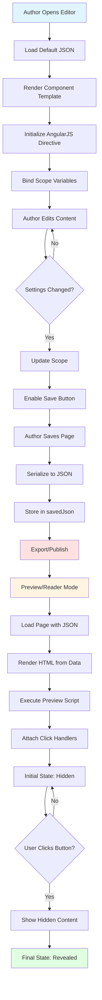

# Click to Reveal Component - Technical Documentation

## Table of Contents
1. [Overview](#overview)
2. [Component Architecture](#component-architecture)
3. [Component Types & Variants](#component-types--variants)
4. [File Structure](#file-structure)
5. [Data Model & Configuration](#data-model--configuration)
6. [Mode-Specific Behavior](#mode-specific-behavior)
7. [Data Flow & Architecture Diagram](#data-flow--architecture-diagram)
8. [Media Support](#media-support)
9. [Styling & Customization](#styling--customization)
10. [Accessibility Features](#accessibility-features)
11. [Known Issues & Limitations](#known-issues--limitations)
12. [Error Handling](#error-handling)
13. [Offline/Package Behavior](#offlinepackage-behavior)
14. [Recommendations for Improvement](#recommendations-for-improvement)

---

## Overview

The **Click to Reveal** component is an interactive learning element that allows authors to hide content behind a clickable button. When learners click the button, additional content (text and/or media) is revealed. This pattern is commonly used for:

- Progressive disclosure of complex information
- Self-assessment scenarios
- Hint/solution reveals
- Supplementary content presentation

**Component Identifier**: `clickToReveal`  
**Template Name**: `Click to Reveal`  
**Icon Class**: `icon-Click-to-reveal`

---

## Component Architecture

### High-Level Structure

The Click to Reveal component follows a multi-layered architecture:

```
┌─────────────────────────────────────────────────────────┐
│                  PRESENTATION LAYER                      │
│  - clickToReveal.html (Main template)                   │
│  - clickToReveal-settings.html (Settings panel)         │
│  - clickToReveal-media-template.html (Media rendering)  │
└─────────────────────────────────────────────────────────┘
                          ↓
┌─────────────────────────────────────────────────────────┐
│                   LOGIC LAYER                            │
│  - clickToReveal.js (AngularJS directive - Editor)      │
│  - clickToRevealpreview1.js (jQuery - Preview/Reader)   │
└─────────────────────────────────────────────────────────┘
                          ↓
┌─────────────────────────────────────────────────────────┐
│                  STYLING LAYER                           │
│  - click-to-reveal-template.css                         │
└─────────────────────────────────────────────────────────┘
                          ↓
┌─────────────────────────────────────────────────────────┐
│                  DATA LAYER                              │
│  - clickToReveal.json (Default configuration)           │
│  - savedJson (Runtime data storage)                     │
└─────────────────────────────────────────────────────────┘
```

### Core Technology Stack

- **Frontend Framework**: AngularJS 1.x (Editor mode)
- **DOM Manipulation**: jQuery (Preview/Reader modes)
- **Video Player**: Video.js
- **Audio Player**: audiojs
- **Styling**: CSS3 with responsive design
- **Data Format**: JSON

---

## Component Types & Variants

### Style Types (4 Variants)

The Click to Reveal component supports **4 distinct style types**, each with different visual treatments:

#### 1. **CTR_Style1** - Classic Card with Background Button
- **Style Class**: `CTR_Style1`
- **Visual Characteristics**:
  - White card background (`#FFFFFF`)
  - Solid background button (`#0054A8`)
  - White button text (`#FFFFFF`)
  - Standard 4px border radius
  - No left border accent
- **Use Case**: Clean, professional look suitable for formal content

#### 2. **CTR_Style2** - Lined Card with Outlined Button
- **Style Class**: `CTR_Style2`
- **Visual Characteristics**:
  - Light teal card background (`#F1F9F9`)
  - **4px left border accent** in teal (`#04948F`)
  - Outlined button with 1px border
  - Button text matches outline color
  - Header: 1.25em font size
- **Use Case**: Emphasis on categorization with color-coded left border

#### 3. **CTR_Style3** - Underlined Header with Outlined Button
- **Style Class**: `CTR_Style3`
- **Visual Characteristics**:
  - Light teal card background (`#F1F9F9`)
  - **Bottom border on header** (1px solid)
  - Outlined button with border
  - Button text matches outline color
  - Header separated with underline
- **Use Case**: Clear header separation, suitable for structured content

#### 4. **CTR_Style4** - Colored Header with Rounded Corners
- **Style Class**: `CTR_Style4`
- **Visual Characteristics**:
  - White card background
  - **Colored header background** (`#0054A8`)
  - 8px top border radius (vs 4px for others)
  - Solid background button
  - White button text
  - Distinct header area with background color
- **Use Case**: Strong visual hierarchy, premium look

### Placement Options

Media can be positioned relative to text in **4 different ways**:

1. **`belowText`** - Media displayed below description text (default)
   - Flexbox: `column-reverse`
   - Icon: `icon-slideshow_img-top-text-bottom`

2. **`aboveText`** - Media displayed above description text
   - Flexbox: `column`
   - Icon: `icon-slideshow_text-top-image-bottom`

3. **`leftSide`** - Media on left, text on right (image only)
   - Flexbox: `row-reverse`
   - Split: 50/50 width
   - Icon: `icon-slideshow_text-left-img-right`

4. **`rightSide`** - Media on right, text on left (image only)
   - Flexbox: `row`
   - Split: 50/50 width
   - Icon: `icon-slideshow_img-left-text-right`

**Note**: Left/right placement is only available for images, not video/audio.

---

## File Structure

```
templates/clickToReveal/
│
├── clickToReveal.html                    # Main component template
├── clickToReveal-settings.html           # Settings panel UI
├── clickToReveal-media-template.html     # Media rendering template
│
├── scripts/
│   ├── clickToReveal.js                  # AngularJS directive (Editor)
│   └── clickToRevealpreview1.js          # jQuery preview/reader script
│
├── styles/
│   └── click-to-reveal-template.css      # Component styling
│
└── default/
    └── clickToReveal.json                # Default configuration schema
```

### Key File Responsibilities

| File | Purpose | Mode |
|------|---------|------|
| `clickToReveal.html` | Main component rendering, editable areas | Editor |
| `clickToReveal-settings.html` | Settings panel with style, media, color options | Editor |
| `clickToReveal-media-template.html` | Media rendering (image/video/audio) | All |
| `clickToReveal.js` | Component logic, event handlers, scope management | Editor |
| `clickToRevealpreview1.js` | Click-to-reveal interaction logic | Preview/Reader |
| `click-to-reveal-template.css` | Styling for all styles and responsive design | All |
| `clickToReveal.json` | Default data structure and configuration | All |

---

## Data Model & Configuration

### Primary Data Structure

```json
{
  "identifier": "Click To Reveal",
  "introduction": "",              // Header text (editable)
  "instruction": "",               // Instruction text (optional)
  "descriptionText": "",           // Hidden content (revealed on click)
  "settings": {
    "templateImage": "icon-Click-to-reveal",
    "templateName": "Click to Reveal",
    "transcriptText": "Read more",  // Button label (max 50 chars)
    "metaTags": [],
    "textLength": 40,
    
    // Visibility Flags
    "isHeaderVisible": true,
    "isInstructionVisible": false,
    "isCaptionVisible": true,
    
    // Style Configuration
    "styleType": "card-style",      // or "full-bleed"
    "styleOption": "CTR_Style1",    // CTR_Style1-4
    "selectedStyle": "CTR_Style1",
    "outline": true,
    
    // Color Configuration
    "CardBackgroundColor": "#FFFFFF",
    "CardHeaderColor": "#0054A8",    // Style4 only
    "CardLineColor": "#04948F",      // Style2/3 only
    "OutlineAppearance": "#DDDDDD",
    "ButtonBackgroundColor": "#0054A8",  // Style1/4
    "ButtonOutlineColor": "#04948F",     // Style2/3
    "ButtonTextColor": "#FFFFFF",
    
    // Media Configuration
    "mediaCheckbox": false,
    "mediaToUpload": "image",        // "image" | "video" | "audio"
    "placement": "belowText",        // "belowText" | "aboveText" | "leftSide" | "rightSide"
    
    // Image Settings
    "imageUrl": "images/image.jpg",
    "imageUploadOrReplace": "Upload",
    "imageName": "Image.jpg",
    "imageDimension": "",
    "dimensionInfo": [],
    
    // Video Settings
    "uploadtype": "uploadbysystem",  // or "uploadbyurl"
    "videoUploadOrReplace": "Upload",
    "youtubeVideoName": "",
    "onlineVideoVendorID": "",
    "filename": "",
    "size": "",
    "duration": "",
    
    // Audio Settings
    "audioUploadOrReplace": "Upload",
    "audioName": "",
    "audioSize": "",
    
    // Style Tabs
    "style_tab": [
      {
        "stylefunction": "ApplystyleCTR",
        "class": "card-style",
        "name": " ",
        "stylesHolder": [
          {
            "name": "CTR_Style1",
            "bgurl": "images/Style/Click-to-reveal/1.png",
            "styleactive": true
          },
          // ... CTR_Style2-4
        ]
      }
    ],
    
    // List Data (Media Details)
    "listData": [
      {
        "mcssData": {
          "type": "Multi Choice Single Select",
          "mediaVisible": false,
          "media": {
            "id": "",
            "src": "images/image.jpg",
            "type": "WEBLINK",
            "altText": "",
            "captionText": "",
            "imageVisible": true,
            "mediaToUpload": "image",
            "isCaptionVisible": true,
            "kaltura": false,
            "videoUploaded": false,
            
            // Image Settings
            "imageSetting": {
              "imageUrl": "images/image.jpg",
              "imageUploadOrReplace": "Upload",
              "imageName": "Image.jpg",
              "imageDimension": "",
              "metaTags": []
            },
            
            // Audio Settings
            "audioSetting": {
              "audioUploadOrReplace": "Upload",
              "audioAlign": "aud-center",
              "audioName": "",
              "metaTags": []
            },
            
            // Video Settings
            "videoSetting": {
              "videoUploadOrReplace": "Upload Video",
              "youtubeVideoName": "",
              "videoUploaded": false,
              "showTranscript": true,
              "showClosedCaptions": true,
              "tracks": [],              // VTT caption files
              "youtube": false,
              "uploadtype": "uploadbysystem",
              "videoAlign": "vid-center",
              "metaTags": []
            }
          }
        }
      }
    ]
  },
  
  // Custom Assets
  "custom": {
    "css": [
      "css/templates/click-to-reveal-template.css"
    ],
    "javascript": [
      "js/jquery-ui.min.js",
      "js/jquery-ui-1.10.3.min.js",
      "js/jquery.ui.touch-punch.js",
      "js/templates/clickToRevealpreview1.js"
    ]
  }
}
```

### Configuration Constraints

| Property | Type | Constraints | Default |
|----------|------|-------------|---------|
| `transcriptText` | String | Max 50 characters | "Read more" |
| `introduction` | HTML String | Editable, supports formatting | "" |
| `descriptionText` | HTML String | Editable, supports formatting | "" |
| `instruction` | HTML String | Editable, supports formatting | "" |
| `altText` | String | Max 2000 characters | "" |
| `metaTags` | String | Comma-separated | "" |
| `placement` | Enum | See Placement Options | "belowText" |
| `styleOption` | Enum | CTR_Style1-4 | "CTR_Style1" |
| `mediaToUpload` | Enum | image, video, audio | "image" |

---

## Mode-Specific Behavior

### Editor Mode

**File**: `clickToReveal.js` (AngularJS directive)

#### Initialization
```javascript
App.directive('clickToRevealTemplate', ['$timeout','$compile', function($timeout, $compile){
  return {
    restrict: 'A',
    link: function(scope, element, attr){
      // Initialization logic
    }
  }
}]);
```

#### Key Features in Editor Mode:

1. **Contenteditable Areas**:
   - Header (`introduction`)
   - Instruction (`instruction`)
   - Description (`descriptionText`)
   - Button label (`transcriptText`)
   - Caption (`captionText`)

2. **Settings Panel Integration**:
   - Opens on element click
   - Syncs with `currSettings`
   - Real-time preview updates
   - Undo/redo support

3. **Media Management**:
   - Upload image/video/audio
   - Configure video tracks (VTT)
   - Set media placement
   - Enable/disable captions

4. **Style Application**:
   - Dynamic style switching via `ApplystyleCTR()`
   - Color picker integration
   - Outline toggling
   - Button style updates based on card style

5. **Video Advanced Features**:
   - Video.js integration
   - Multiple caption tracks
   - Transcript support
   - Language selection
   - Fullscreen mode support
   - Settings overlay panel

#### Event Handlers

| Event | Handler | Purpose |
|-------|---------|---------|
| `click` (element) | Opens settings panel | Display component settings |
| `click` (intro/description) | `introClick()` | Focus and show settings |
| `keydown` (Enter) | `handleKeyDown()` | Insert `<br>` instead of `<div>` |
| `change` (header visibility) | `onHeaderVisibilityChanged()` | Toggle header display |
| `change` (instruction visibility) | `onInstructionVisibilityChanged()` | Toggle instruction display |
| `change` (media checkbox) | `addMediaClickCTR()` | Enable/disable media |
| `change` (media type) | `setMediaToUpload()` | Switch between image/video/audio |
| `change` (placement) | `placementChange()` | Update media position |
| `change` (caption visibility) | `onCaptionVisibilityChanged()` | Show/hide caption |
| `click` (video track) | `changeVideoTrackFromOverlay()` | Switch caption language |
| `click` (style) | `ApplystyleCTR()` | Apply selected style |

#### Scope Variables

```javascript
scope.fieldData = {
  introduction: "",
  instruction: "",
  descriptionText: "",
  settings: { /* configuration object */ }
};

scope.currSettings = con.savedJson[pageNo][uniqueId].settings;
```

### Preview/Reader Mode

**File**: `clickToRevealpreview1.js` (jQuery)

#### Initialization
```javascript
$(function(){
  var clickToRevelTemplate = $('body').find('[data-type="clickToReveal"]');
  
  // Set default button text if empty
  $.each(clickToRevelTemplate, function (e) {
    if(clickToRevelTemplate.eq(e).find(".transcriptTextCorrection").text() == ""){
      clickToRevelTemplate.eq(e).find(".transcriptTextCorrection").html('View more');
    }
  });
  
  // Initial state: hidden content
  $(".ClickToRevealData").css("display","none");
  $(".transcriptTextCorrection").css("display","block");
});
```

#### Interaction Flow

```
┌─────────────────────────────────────────────────────────┐
│  1. Component renders with visible content:             │
│     - Header                                             │
│     - Instruction                                        │
│     - Button (e.g., "Read more")                         │
│                                                          │
│  2. Hidden content (CSS display:none):                   │
│     - Description text                                   │
│     - Media (if enabled)                                 │
└─────────────────────────────────────────────────────────┘
                          ↓
                    USER CLICKS BUTTON
                          ↓
┌─────────────────────────────────────────────────────────┐
│  3. Button click handler executes:                       │
│     - Hide button                                        │
│     - Show description text                              │
│     - Show media (flex layout)                           │
│     - Apply placement (above/below/left/right)           │
└─────────────────────────────────────────────────────────┘
                          ↓
┌─────────────────────────────────────────────────────────┐
│  4. Content fully revealed:                              │
│     - All text visible                                   │
│     - Media displayed                                    │
│     - No way to hide again (one-way interaction)         │
└─────────────────────────────────────────────────────────┘
```

#### Click Handler Implementation

```javascript
$(".transcriptTextCorrection").off('click').click(function(event){
  event.preventDefault();
  var $eventTarget = $(event.target),
      $form = $eventTarget.parents('.clickToReveal');
  
  // Hide button container
  $form.find(".transcriptTextCorrection").parent('.innerPadding').css("display","none");
  
  // Show description
  $form.find(".descriptionTextCorrection").css("display","block");
  
  // Show media container with flex layout
  $form.find(".ClickToRevealData").css("display","flex");
});
```

#### Key Characteristics:

1. **One-Time Interaction**: Once revealed, content cannot be hidden again
2. **No State Persistence**: Refresh returns to hidden state
3. **Simple DOM Manipulation**: Uses jQuery show/hide
4. **Event Delegation**: `.off('click').click()` prevents duplicate handlers
5. **Responsive**: Flex layout adapts to placement settings

---

## Data Flow & Architecture Diagram

### Component Lifecycle



### Data Flow: Editor to Reader

```
┌─────────────────────────────────────────────────────────┐
│                    AUTHORING PHASE                       │
└─────────────────────────────────────────────────────────┘
                          ↓
     clickToReveal.json (Default Template)
                          ↓
     AngularJS Controller ($scope.fieldData)
                          ↓
     Settings Panel Updates (currSettings)
                          ↓
     DOM Updates (ng-model bindings)
                          ↓
     Save Action (con.savedJson[pageNo][uniqueId])
                          ↓
┌─────────────────────────────────────────────────────────┐
│                  SERIALIZATION PHASE                     │
└─────────────────────────────────────────────────────────┘
                          ↓
     JSON Export (with custom CSS/JS references)
                          ↓
     Package Generation (SCORM/xAPI)
                          ↓
┌─────────────────────────────────────────────────────────┐
│                  CONSUMPTION PHASE                       │
└─────────────────────────────────────────────────────────┘
                          ↓
     HTML Rendering (data-type="clickToReveal")
                          ↓
     CSS Application (click-to-reveal-template.css)
                          ↓
     Script Execution (clickToRevealpreview1.js)
                          ↓
     User Interaction (click → reveal)
```

### Settings Panel Data Binding

```
User Input (Settings Panel)
          ↓
    ng-model bindings
          ↓
    currSettings object
          ↓
    templateScope.fieldData.settings
          ↓
    DOM updates (ng-style, ng-class)
          ↓
    Visual changes (preview)
```

### Style Application Flow

```
ApplystyleCTR(event, styleOption, styleType, index, parentIndex)
          ↓
    Remove existing style classes
          ↓
    Update templateScope.fieldData.settings.styleOption
          ↓
    Add new style classes to element
          ↓
    Update color properties based on style:
     - CTR_Style1 → White bg, solid button
     - CTR_Style2 → Teal bg, outlined button, left border
     - CTR_Style3 → Teal bg, outlined button, header border
     - CTR_Style4 → White bg, colored header, solid button
          ↓
    Mark style as active in settings
          ↓
    Apply visual changes (ng-style bindings)
```

---

## Media Support

### Supported Media Types

#### 1. Image
- **Formats**: JPG, PNG, SVG
- **Upload Method**: System upload
- **Placement**: All 4 options (above/below/left/right)
- **Features**:
  - Alt text support
  - Caption support (toggle)
  - Dimension tracking
  - Aspect ratio: 16:9 (maintained)
  - Background color: #E8F1F6

**Template**:
```html

```

#### 2. Video
- **Formats**: MP4
- **Upload Methods**: 
  - System upload
  - YouTube URL (by Video ID)
- **Placement**: Above/below text only
- **Player**: Video.js
- **Features**:
  - Closed captions (CC)
  - Transcript display
  - Multiple caption tracks (VTT format)
  - Language selection
  - Custom settings overlay
  - Fullscreen support
  - Poster image support

**Video Settings Panel**:
```html
<div class="videoSettingPanelOverlay">
  <div class="videoSettingsToggleSection">
    <!-- Transcript toggle -->
    <!-- CC toggle -->
  </div>
  <div class="videoLanguageSelectorSection">
    <!-- Language selection -->
  </div>
</div>
```

**Track Management**:
- VTT file upload
- Multiple languages supported
- Automatic track loading
- Dynamic caption switching
- Transcript generation from VTT

**Track Loading Code**:
```javascript
for(var t=0; t < trackMainList.length; t++){
  track = document.createElement("track");
  track.kind = "captions";
  track.label = trackMainList[t].label;
  track.dataset.src = trackMainList[t].datasrc;
  track.default = (t == 0);
  
  // Token-based authentication
  var ogsrc = trackMainList[t].ogSrc;
  var ogsrcArr = ogsrc.split('/');
  ogsrcArr[8] = scope.$parent.userToken;
  track.src = ogsrcArr.join('/');
  
  video.appendChild(track);
}
```

#### 3. Audio
- **Formats**: MP3
- **Upload Method**: System upload
- **Placement**: Above/below text only
- **Player**: audiojs
- **Features**:
  - Alt text support
  - Caption support
  - Custom audio controls
  - Center alignment
  - Disabled state visual (pointer-events: none)

**Template**:
```html
<audio class="pc-audio primary-audio" 
       alt={{fieldData.altText}} 
       controls 
       src="{{fieldData.src | trusted}}" 
       data-audiosrc="{{fieldData.media.src}}">
  <source ng-src="{{fieldData.media.src}}" type="audio/mpeg">
  Your browser does not support HTML5 Audio.
</audio>
```

### Media Dimension Handling

- **Image**: Tracks width/height in `dimensionInfo` array
- **Video**: Aspect ratio preserved, resolution tracked
- **Audio**: Standard HTML5 audio control size

### Media State Management

```javascript
// Enable media
scope.addMediaClickCTR = function(state) {
  if (state) {
    // Enable media visibility
    currentscope.fieldData.settings.listData[0].mcssData.mediaVisible = true;
    currentscope.fieldData.settings.mediaToUpload = 'image';
    currentscope.fieldData.settings.imageUploadOrReplace = "Upload";
  } else {
    // Disable media
    currentscope.fieldData.settings.listData[0].mcssData.mediaVisible = false;
  }
};
```

---

## Styling & Customization

### CSS Architecture

The component uses a modular CSS approach with:

1. **Base Styles**: `.clickToReveal`
2. **Style Variants**: `.CTR_Style1` - `.CTR_Style4`
3. **Placement Modifiers**: `.belowText`, `.aboveText`, `.leftSide`, `.rightSide`
4. **Layout Modifiers**: `.card-style`, `.full-bleed`
5. **Responsive Classes**: `.row-fluid-margin-for-*`

### Style-Specific CSS

```css
/* CTR_Style1 - Classic */
.clickToReveal.CTR_Style1 .titleTextCorrection {
  min-height: 24px !important;
  font-size: 1rem;
}

/* CTR_Style2 - Left Border */
.clickToReveal.CTR_Style2 .titleTextCorrection {
  font-size: 1.4rem;
}
/* Border added via ng-style in HTML */

/* CTR_Style3 - Header Underline */
/* Border-bottom added via ng-style */

/* CTR_Style4 - Colored Header */
/* Border-radius 8px on header */
/* Background color on header via ng-style */
```

### Flexbox Layout for Placement

```css
/* Below text (default) */
.clickToReveal .ClickToRevealData.belowText {
  flex-direction: column-reverse;
}

/* Above text */
.clickToReveal .ClickToRevealData.aboveText {
  flex-direction: column;
}

/* Left side */
.clickToReveal .ClickToRevealData.leftSide {
  flex-direction: row-reverse;
}

/* Right side */
.clickToReveal .ClickToRevealData.rightSide {
  flex-direction: row;
}

/* 50/50 split for left/right */
.leftSide.clickToReveal .description-text, 
.leftSide.clickToReveal .template-width-5 {
  float: left;
  width: 50%;
  flex: 1;
}
```

### Responsive Design

```css
/* Tablet Portrait */
.row-fluid-margin-for-tablet-port .clickToReveal .titleTextCorrection {
  font-size: 1.2rem;
}

/* Mobile Portrait */
.row-fluid-margin-for-mobile-port .clickToReveal .titleTextCorrection {
  font-size: 1.2rem;
}

/* Force column layout on mobile for left/right placement */
.row-fluid-margin-for-mobile-port .clickToReveal .ClickToRevealData.rightSide {
  flex-direction: column;
}

.row-fluid-margin-for-mobile-port .clickToReveal .ClickToRevealData.leftSide {
  flex-direction: column-reverse;
}

/* Full width on mobile */
.row-fluid-margin-for-mobile-port .leftSide.clickToReveal .description-text,
.row-fluid-margin-for-mobile-port .rightSide.clickToReveal .description-text {
  width: 100%;
}
```

### Color Customization

Colors are applied via Angular `ng-style` bindings:

```html
ng-style="{
  'border': fieldData.settings.outline ? '1px solid' + fieldData.settings.OutlineAppearance : 'none',
  'background': fieldData.settings.CardBackgroundColor,
  'border-left': fieldData.settings.selectedStyle == 'CTR_Style2' ? 
                 '4px solid' + fieldData.settings.CardLineColor : '...',
  'border-top-left-radius': fieldData.settings.selectedStyle == 'CTR_Style4' ? '8px' : '4px'
}"
```

### Button Styling

```html
<button ng-style="{
  'background-color': fieldData.settings.selectedStyle == 'CTR_Style1' || 
                      fieldData.settings.selectedStyle == 'CTR_Style4' ? 
                      fieldData.settings.ButtonBackgroundColor : 'transparent',
  'border': fieldData.settings.selectedStyle == 'CTR_Style2' || 
            fieldData.settings.selectedStyle == 'CTR_Style3' ? 
            '1px solid' + fieldData.settings.ButtonOutlineColor : 'transparent',
  'color': fieldData.settings.ButtonTextColor
}">
```

### Font Sizing

| Element | Desktop | Tablet | Mobile |
|---------|---------|--------|--------|
| Header (Style2) | 1.4rem | 1.2rem | 1.2rem |
| Header (Style1) | 1rem | 1.2rem | 1.2rem |
| Instruction | 1rem | 1rem | 1rem |
| Description | 1rem | 1rem | 1rem |
| Button | 14px (fixed) | 14px | 14px |

---

## Accessibility Features

### 1. Alt Text
- **Field**: `fieldData.altText`
- **Max Length**: 2000 characters
- **Purpose**: Screen reader support for media
- **Applied To**: Images, videos, audio

```html

<video alt={{fieldData.altText}} ...>
<audio alt={{fieldData.altText}} ...>
```

### 2. Keyboard Navigation
- **Enter Key**: Submits changes, inserts line breaks
- **Tab Navigation**: Focus management for editable areas
- **Custom Handler**:
```javascript
scope.handleKeyDown = function($event) {
  if ($event.key === 'Enter') {
    $event.preventDefault();
    const range = selection.getRangeAt(0);
    const br = document.createElement("br");
    range.insertNode(br);
    // Move cursor after <br>
  }
}
```

### 3. ARIA Attributes
- Buttons have proper roles
- Expandable sections use `aria-expanded`
- Settings panels use `aria-hidden`

### 4. Closed Captions (Video)
- VTT format support
- Multiple languages
- User-controllable
- Visible toggle in settings

### 5. Transcripts (Video)
- Generated from VTT files
- Synchronized with video playback
- Active cue highlighting
- Auto-scroll to active line
- RTL support for languages like Arabic

```javascript
track.addEventListener("cuechange", function(event){
  var cueTime = event.target.track.activeCues[0].startTime;
  var activeCue = $(video).parents('.customClass').find('#transcript [data-begin='+cueTime+']')[0];
  $(activeCue).addClass('is-active');
  transcriptBody.scrollTop = activeCue.offsetTop;
});
```

### 6. Color Contrast
- Default colors meet WCAG AA standards
- Customizable via settings
- Button text color adjustable

### 7. Focus Management
- `.focus()` called on editable elements
- Visual focus indicators
- Focus trap in settings panel

---

## Known Issues & Limitations

### 1. **One-Way Interaction (Preview/Reader)**
- **Issue**: Once content is revealed, it cannot be hidden again
- **Impact**: Users cannot re-hide content if revealed accidentally
- **Workaround**: None; requires page refresh
- **Recommendation**: Add toggle functionality

### 2. **Button Text Truncation**
- **Issue**: Button text limited to 50 characters, but no visual truncation
- **Impact**: Long text may overflow button
- **Current CSS**:
```css
.transcriptTextCorrection {
  max-width: 50ch;
}
```
- **Recommendation**: Add `text-overflow: ellipsis`

### 3. **Video Track Token Hardcoding**
- **Issue**: Token position hardcoded at index 8 in URL array
```javascript
ogsrcArr[8] = scope.$parent.userToken;
```
- **Impact**: Breaks if URL structure changes
- **Recommendation**: Use regex or proper URL parsing

### 4. **Duplicate Event Handlers**
- **Observed**: `.off('click').click()` pattern suggests potential issue
- **Impact**: Multiple bindings if script runs multiple times
- **Recommendation**: Use event delegation or single binding

### 5. **No State Persistence**
- **Issue**: Revealed state not saved
- **Impact**: Refresh resets to hidden
- **Use Case**: Not suitable for bookmarking progress
- **Recommendation**: Add localStorage or xAPI tracking

### 6. **Left/Right Placement Limited to Images**
- **Issue**: Video/audio cannot use left/right placement
- **Code**:
```javascript
case 'video':
  scope.placementChange('belowText');  // Forces below
```
- **Impact**: Layout limitation for video-based reveals
- **Recommendation**: Support all media types for left/right

### 7. **Media Upload Error Handling**
- **Issue**: No visible error messages for failed uploads
- **Impact**: Silent failures confuse authors
- **Recommendation**: Add error notifications

### 8. **Responsive Issues on Mobile**
- **Issue**: Fixed 50/50 split may not work on small screens
- **Workaround**: CSS forces column layout for left/right on mobile
- **Impact**: Placement preference not honored on mobile

### 9. **Caption Visibility Logic**
- **Issue**: Caption checkbox affects multiple media types inconsistently
- **Code Reference**: `isCaptionVisible` and `listData[0].mcssData.media.isCaptionVisible`
- **Impact**: Confusing behavior when switching media types

### 10. **Style Change Clears Colors**
- **Issue**: Changing style type resets some colors
- **Code**:
```javascript
switch(styleOption) {
  case 'CTR_Style1':
    templateScope.fieldData.settings.ButtonTextColor = "#FFFFFF";
    break;
}
```
- **Impact**: Author customizations lost
- **Recommendation**: Preserve custom colors

### 11. **Commented Code**
- **Observed**: Extensive commented code in JS files
- **Impact**: Maintenance confusion, code bloat
- **Recommendation**: Clean up or document reasons

### 12. **jQuery Version Conflicts**
- **Multiple jQuery versions loaded**:
  - jquery-1.9.1.js
  - jquery-min.js
  - jquery-ui.min.js
- **Impact**: Potential conflicts, performance overhead
- **Recommendation**: Use single jQuery version

### 13. **Video.js Settings Panel Positioning**
- **Issue**: Settings overlay may not position correctly in fullscreen
- **Code**:
```javascript
player.on('fullscreenchange', function(e){
  if(isFullScreen){
    source.detach().appendTo(destination);  // Repositioning
  }
});
```
- **Impact**: UI elements hidden or misplaced

### 14. **No Validation for Button Text Length**
- **Issue**: Backend allows 50 chars, but frontend doesn't enforce
- **Impact**: Authors may exceed limit
- **Recommendation**: Add character counter and validation

---

## Error Handling

### Current Error Handling

#### 1. **Upload Validation**
- Basic file type checking
- No size validation visible
- No error messages displayed

#### 2. **Video Loading**
```javascript
if (element.find('video').length !== 0) {
  // Proceed with video.js initialization
}
```

#### 3. **Missing Media Handling**
```javascript
if ($(element).find('video').attr('src') == 'undefined' || 
    $(element).find('video').attr('src') === undefined) {
  $(element).find('video').attr('src', videoScr);
}
```

#### 4. **Null Checks for Scope**
```javascript
var templateScope = $('#target').parents('.sd-item').eq(0).find('[click-to-reveal-template]').scope();
if(templateScope == undefined){
  templateScope = $('#target').parents('.sd-item').eq(0).find('[click-to-reveal-template]').scope();
}
```
**Note**: This attempts same operation twice, unlikely to fix the issue.

#### 5. **Default Text Handling**
```javascript
if(clickToRevelTemplate.eq(e).find(".transcriptTextCorrection").text() == ""){
  clickToRevelTemplate.eq(e).find(".transcriptTextCorrection").html('View more');
}
```

### Missing Error Handling

1. **Network Failures**: No retry logic for media loading
2. **Malformed JSON**: No validation on load
3. **Track Loading Failures**: Silent failures for VTT files
4. **Cross-Origin Issues**: No CORS error handling
5. **Token Expiration**: Video tracks may fail if token expires
6. **Browser Compatibility**: No feature detection

### Recommendations

```javascript
// Proposed error handling wrapper
scope.safeMediaLoad = function(mediaType, mediaSrc) {
  try {
    // Validate source
    if (!mediaSrc || mediaSrc === "images/image.jpg") {
      showError("No media selected");
      return;
    }
    
    // Attempt load with timeout
    var loadTimeout = setTimeout(function(){
      showError("Media failed to load");
    }, 10000);
    
    // Clear timeout on success
    mediaElement.onload = function(){
      clearTimeout(loadTimeout);
    };
    
  } catch(e) {
    console.error("Media load error:", e);
    showError("An error occurred loading media");
  }
};
```

---

## Offline/Package Behavior

### SCORM/xAPI Package

The Click to Reveal component is designed to work in offline packages:

#### 1. **Asset Bundling**
- CSS files included in package
- JavaScript files bundled
- Media files embedded or linked
- Fonts packaged

#### 2. **Media Handling in Packages**

**System-Uploaded Media**:
- Stored in package assets folder
- Relative paths maintained
- Accessible offline

**Online Media (YouTube)**:
- **Issue**: Requires internet connection
- **Impact**: Cannot play in offline package
- **Detection**: Check for network connectivity
- **Fallback**: Show placeholder or error message

#### 3. **Video Tracks (VTT)**
- Token-based authentication may break offline
- **Current Issue**:
```javascript
ogsrcArr[8] = scope.$parent.userToken;
track.src = ogsrcArr.join('/');
```
- **Impact**: Captions fail without valid token
- **Recommendation**: Package VTT files locally in offline mode

#### 4. **External Dependencies**

**Required CDN Resources** (potential issues):
- Video.js (if CDN-linked)
- jQuery (if CDN-linked)
- Web fonts (if external)

**Recommendation**: Bundle all dependencies locally for offline packages.

#### 5. **State Persistence in SCORM**

**Current Behavior**:
- No state saved to SCORM API
- Revealed state lost on page change
- No completion tracking

**Recommendation**:
```javascript
// Save state to SCORM
function saveRevealState(componentId, revealed) {
  var cmi = pipwerks.SCORM.data;
  cmi.set("cmi.suspend_data." + componentId + ".revealed", revealed);
  cmi.save();
}

// Restore state on load
function restoreRevealState(componentId) {
  var cmi = pipwerks.SCORM.data;
  var revealed = cmi.get("cmi.suspend_data." + componentId + ".revealed");
  if (revealed === "true") {
    // Auto-reveal content
  }
}
```

#### 6. **Package Export Process**

**From Editor**:
1. Serialize component data to JSON
2. Include custom CSS/JS references
3. Generate HTML with `data-type="clickToReveal"`
4. Package media assets
5. Create manifest (SCORM) or tincan.xml (xAPI)

**File References in Package**:
```json
"custom": {
  "css": ["css/templates/click-to-reveal-template.css"],
  "javascript": [
    "js/jquery-ui.min.js",
    "js/templates/clickToRevealpreview1.js"
  ]
}
```

#### 7. **Offline Testing Checklist**

- [ ] All CSS files load
- [ ] All JavaScript files load
- [ ] System-uploaded images display
- [ ] System-uploaded videos play
- [ ] System-uploaded audio plays
- [ ] VTT captions load (if packaged)
- [ ] Transcript displays (if enabled)
- [ ] Button click reveals content
- [ ] Responsive layout works
- [ ] Styles render correctly
- [ ] No console errors
- [ ] No missing assets (404s)

---

## Recommendations for Improvement

### High Priority

#### 1. **Add Toggle Functionality (Preview/Reader)**
**Current**: One-way reveal only
**Proposed**: Allow hiding/showing content
```javascript
$(".transcriptTextCorrection").click(function(event){
  var $form = $eventTarget.parents('.clickToReveal');
  var $content = $form.find(".ClickToRevealData");
  
  if($content.is(':visible')){
    $content.css("display","none");
    $(this).text("Show more");
  } else {
    $content.css("display","flex");
    $(this).text("Show less");
  }
});
```

#### 2. **Fix Token Hardcoding**
**Current**: `ogsrcArr[8] = scope.$parent.userToken;`
**Proposed**: Use URL parsing
```javascript
var url = new URL(trackMainList[t].ogSrc);
url.searchParams.set('token', scope.$parent.userToken);
track.src = url.toString();
```

#### 3. **Add Error Notifications**
```javascript
scope.showError = function(message) {
  var notification = $('<div class="ctr-error">' + message + '</div>');
  element.prepend(notification);
  setTimeout(function(){
    notification.fadeOut();
  }, 3000);
};
```

#### 4. **Implement State Persistence**
```javascript
// LocalStorage for preview
localStorage.setItem('ctr_' + componentId + '_revealed', 'true');

// SCORM for packages
pipwerks.SCORM.set('cmi.suspend_data.ctr_' + componentId, 'true');
```

#### 5. **Add Character Counter for Button Text**
```html
<div class="max_text">
  Chars <span class="char-count">{{50 - currSettings.transcriptText.length}}</span>
</div>
<textarea ng-model="currSettings.transcriptText" 
          maxlength="50" 
          ng-change="updateCharCount()"></textarea>
```

### Medium Priority

#### 6. **Support Left/Right Placement for Video/Audio**
```javascript
case 'video':
case 'audio':
  // Allow all placements, not just above/below
  // May require layout adjustments
```

#### 7. **Add Animation for Reveal**
```css
.ClickToRevealData {
  transition: all 0.3s ease-in-out;
  opacity: 0;
  transform: translateY(-10px);
}

.ClickToRevealData.revealed {
  opacity: 1;
  transform: translateY(0);
}
```

```javascript
$form.find(".ClickToRevealData").addClass('revealed');
```

#### 8. **Improve Responsive Behavior**
```css
/* Better mobile breakpoints */
@media (max-width: 768px) {
  .clickToReveal .ClickToRevealData.leftSide,
  .clickToReveal .ClickToRevealData.rightSide {
    flex-direction: column !important;
  }
  
  .clickToReveal .description-text,
  .clickToReveal .template-width-5 {
    width: 100% !important;
  }
}
```

#### 9. **Add Loading States**
```html
<div class="ctr-loading" ng-if="mediaLoading">
  <span class="icon-spinner"></span> Loading media...
</div>
```

#### 10. **Preserve Custom Colors on Style Change**
```javascript
// Store custom colors before style change
var userColors = {
  buttonText: templateScope.fieldData.settings.ButtonTextColor,
  buttonBg: templateScope.fieldData.settings.ButtonBackgroundColor
};

// Apply defaults for style
applyStyleDefaults(styleOption);

// Restore user colors if they differ from old defaults
if(userColors.buttonText !== oldDefaults.buttonText) {
  templateScope.fieldData.settings.ButtonTextColor = userColors.buttonText;
}
```

### Low Priority

#### 11. **Clean Up Commented Code**
- Remove obsolete comments
- Document reasons for keeping commented sections
- Use proper version control instead of commenting

#### 12. **Consolidate jQuery Versions**
```html
<!-- Use single jQuery version -->
<script src="js/jquery-3.6.0.min.js"></script>
<script src="js/jquery-ui.min.js"></script>
```

#### 13. **Add Analytics Tracking**
```javascript
$(".transcriptTextCorrection").click(function(){
  // Track reveal event
  if(typeof trackEvent === 'function'){
    trackEvent('click_to_reveal', 'revealed', componentId);
  }
});
```

#### 14. **Accessibility Enhancements**
```html
<!-- Add ARIA attributes -->
<button class="transcriptTextCorrection" 
        aria-expanded="false" 
        aria-controls="hidden-content">
  Read more
</button>

<div id="hidden-content" 
     class="ClickToRevealData" 
     aria-hidden="true">
  <!-- Content -->
</div>
```

```javascript
// Update on click
button.attr('aria-expanded', 'true');
content.attr('aria-hidden', 'false');
```

#### 15. **Add Preview Mode in Editor**
```html
<button ng-click="previewComponent()" class="preview-btn">
  Preview Interaction
</button>
```

```javascript
scope.previewComponent = function(){
  // Temporarily hide settings
  // Show preview modal
  // Load preview script
  // Demonstrate click-to-reveal behavior
};
```

### Architectural Improvements

#### 16. **Separate Business Logic from UI**
**Current**: Tightly coupled
**Proposed**: MVC separation
```javascript
// Model
var CTRModel = {
  data: {},
  save: function(){...},
  load: function(){...}
};

// View
var CTRView = {
  render: function(){...},
  update: function(){...}
};

// Controller
var CTRController = {
  init: function(){...},
  handleReveal: function(){...}
};
```

#### 17. **Use Modern JavaScript**
**Current**: ES5 syntax
**Proposed**: ES6+ with transpilation
```javascript
// Current
var templateScope = $('#target').parents('.sd-item').eq(0).find('[click-to-reveal-template]').scope();

// Proposed
const templateScope = $('#target')
  .closest('.sd-item')
  .find('[click-to-reveal-template]')
  .scope();
```

#### 18. **Implement Unit Tests**
```javascript
describe('Click to Reveal', function(){
  it('should hide content initially', function(){
    expect($('.ClickToRevealData').is(':visible')).toBe(false);
  });
  
  it('should reveal content on button click', function(){
    $('.transcriptTextCorrection').click();
    expect($('.ClickToRevealData').is(':visible')).toBe(true);
  });
});
```

#### 19. **Add Configuration Validation**
```javascript
scope.validateSettings = function(settings){
  var errors = [];
  
  if(!settings.transcriptText || settings.transcriptText.length > 50){
    errors.push("Button text must be 1-50 characters");
  }
  
  if(settings.mediaCheckbox && !settings.mediaToUpload){
    errors.push("Media type must be selected");
  }
  
  return errors;
};
```

#### 20. **Create Component API**
```javascript
// Public API for external interaction
window.ClickToRevealAPI = {
  reveal: function(componentId){
    $('#' + componentId).find('.transcriptTextCorrection').click();
  },
  
  hide: function(componentId){
    // If toggle implemented
  },
  
  getState: function(componentId){
    return {
      revealed: $('#' + componentId).find('.ClickToRevealData').is(':visible')
    };
  }
};
```

---

## Conclusion

The Click to Reveal component is a functional interactive learning element with robust editor support and basic preview/reader functionality. Key strengths include:

- **Multiple style variants** for visual diversity
- **Comprehensive media support** (image, video, audio)
- **Video.js integration** with captions and transcripts
- **Flexible placement options**
- **Rich customization** via settings panel

Primary areas for improvement:

- **Two-way interaction** (currently one-way)
- **State persistence** for bookmarking
- **Better error handling** and user feedback
- **Code cleanup** and modernization
- **Enhanced accessibility** features

With the recommended improvements, this component can provide a more robust and user-friendly learning experience while maintaining ease of authoring and deployment flexibility.


