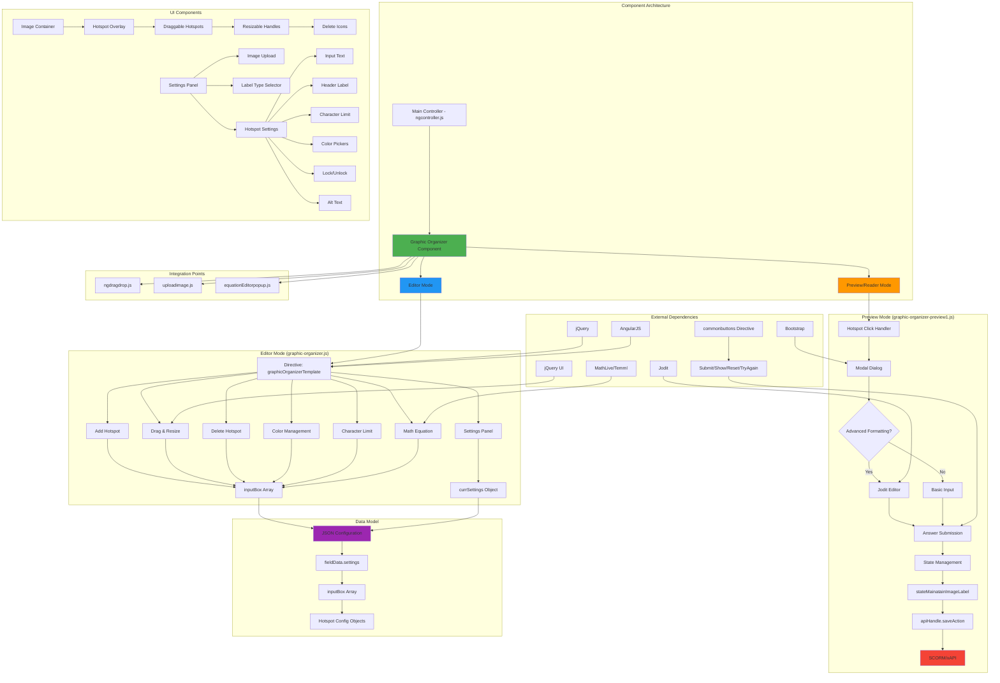

# Graphic Organizer (Image GO) Component - Technical Documentation

## Table of Contents
1. [Overview](#overview)
2. [Component Architecture](#component-architecture)
3. [File Structure](#file-structure)
4. [Component Types and Variants](#component-types-and-variants)
5. [Data Model](#data-model)
6. [Editor Mode](#editor-mode)
7. [Preview/Reader Mode](#preview-reader-mode)
8. [Data Flow and Rendering Logic](#data-flow-and-rendering-logic)
9. [Architectural Diagram](#architectural-diagram)
10. [Key Features](#key-features)
11. [User Interactions](#user-interactions)
12. [State Management](#state-management)
13. [Offline/Package Behavior](#offline-package-behavior)
14. [Error Handling](#error-handling)
15. [Known Issues](#known-issues)
16. [Recommendations for Improvement](#recommendations-for-improvement)

---

## Overview

The **Graphic Organizer (Image GO)** component, identified as `graphicOrganizerImageHotSpot`, is an interactive authoring component that allows content creators to:
- Upload an image and add multiple draggable/resizable hotspots on it
- Configure text inputs for each hotspot with customization options
- Enable learners to interact with hotspots and submit responses in preview/reader mode
- Support advanced formatting (Jodit editor) and mathematical equations (MathLive)

### Component Identifier
- **Data Type**: `graphicOrganizerImageHotSpot`
- **Template Name**: Graphic Organizer
- **Icon Class**: `icon-Image-labelling_number-01`

---

## Component Architecture

### Technology Stack
- **Frontend Framework**: AngularJS 1.x
- **UI Libraries**: jQuery, jQuery UI (draggable, resizable)
- **Rich Text Editor**: Jodit Editor (conditional)
- **Math Equation Support**: MathLive, Temml
- **Styling**: CSS3 with custom stylesheets
- **Modal Management**: Bootstrap modals

### Component Layers
1. **Presentation Layer**: HTML templates for editor and settings
2. **Controller Layer**: AngularJS directives and jQuery event handlers
3. **Data Layer**: JSON-based configuration and state management
4. **Interaction Layer**: User event handlers for authoring and learning

---

## File Structure

```
templates/graphic-organizer/
├── graphic-organizer.html                    # Main editor template
├── graphic-organizer-image-setting.html      # Settings panel template
├── default/
│   └── graphic-organizer.json                # Default configuration
├── scripts/
│   ├── graphic-organizer.js                  # Editor mode directive
│   └── graphic-organizer-preview1.js         # Preview/reader mode script
└── styles/
    ├── graphic-organizer-template.css        # Main styles
    └── graphice-organizer-image-setting.css  # Settings panel styles
```

### File Responsibilities

#### 1. `graphic-organizer.html`
- Main component template rendered in editor mode
- Contains image container with hotspot overlay
- Implements draggable/resizable hotspot divs
- Includes modal dialogs for extended input
- Integrates `commonbuttons` directive for Submit/Show/Reset/Try Again

#### 2. `graphic-organizer-image-setting.html`
- Right panel settings for component configuration
- Image upload/replace interface
- Label type selector (Primary/Secondary)
- Per-hotspot settings:
  - Input answer text
  - Header label
  - Character limit
  - Lock for student option
  - Background color picker
  - Outline color picker
  - Alt text
  - Apply to all inputs

#### 3. `default/graphic-organizer.json`
- Default configuration template
- Defines initial state structure
- Specifies custom CSS and JavaScript dependencies

#### 4. `scripts/graphic-organizer.js`
- AngularJS directive: `graphicOrganizerTemplate`
- Handles editor mode functionality:
  - Add hotspot button logic
  - Hotspot click/selection logic
  - Drag and position calculation
  - Resize handling
  - Delete hotspot functionality
  - Settings synchronization
  - Character limit enforcement
  - Color application (background/outline)
  - Math equation rendering

#### 5. `scripts/graphic-organizer-preview1.js`
- Preview/reader mode functionality
- Modal interaction handlers
- Jodit editor initialization (conditional)
- Answer submission and state management
- `stateMainatainImageLabel()` for SCORM/xAPI tracking
- Show Answer, Try Again, Reset handlers

#### 6. `styles/graphic-organizer-template.css`
- Component styling for editor and preview
- Hotspot container positioning
- Modal styling
- Scrollbar customization
- Math equation display
- Responsive design elements

#### 7. `styles/graphice-organizer-image-setting.css`
- Settings panel specific styles
- Color picker UI
- Input field styling

---

## Component Types and Variants

### Single Type Component
The Graphic Organizer component has **one primary type** with configurable options:

**Type: graphicOrganizerImageHotSpot**
- Supports multiple hotspots on a single image
- Each hotspot is independently configurable
- No sub-types or variants

### Configurable Features
Though there's a single type, the component supports various configurations:
1. **Label Type Display**:
   - Primary label
   - Secondary label
   - Hidden (no label)

2. **Hotspot Input Mode**:
   - Basic text input
   - Advanced formatting (Jodit editor)
   - Math equation support

3. **Interaction Modes**:
   - Interactive (submit/show/reset/try again)
   - Non-interactive (display only)

---

## Data Model

### JSON Structure

```json
{
  "identifier": "graphicOrganizerImageHotSpot",
  "question": "Question 1",
  "secondaryQuestion": "Part A",
  "settings": {
    "labelType": "primary",
    "keyData": "image",
    "isLabelTypeIamge": false,
    "src": "images/image.jpg",
    "altText": "Alt Text of Image",
    "inputBox": [
      {
        "id": 1,
        "inputLabel": "Header label text",
        "inputAnswer": "Answer content",
        "charLimitCheck": false,
        "charLimit": 100,
        "applyAllInput": false,
        "height": "10%",
        "width": "25%",
        "bgColor": "#FEFFFF",
        "outlineColor": "#1E1E1E",
        "xcords": "10%",
        "ycords": "10%",
        "lockForStudent": false,
        "advancedFormatting": false,
        "altText": ""
      }
    ],
    "activeInput": 0,
    "imageUploadOrReplace": "Upload",
    "advancedFormatting": false,
    "formattingValue": "ELA"
  },
  "custom": {
    "css": ["css/templates/graphic-organizer-template.css"],
    "javascript": ["js/templates/graphic-organizer-preview1.js"]
  }
}
```

### Data Model Fields

#### Root Level
- **identifier**: Component type identifier
- **question**: Primary question text (shown when labelType is "primary")
- **secondaryQuestion**: Secondary question text (shown when labelType is "secondary")
- **settings**: Configuration object
- **custom**: External resource dependencies

#### Settings Object
- **labelType**: "primary" | "secondary" - Determines which question label to display
- **keyData**: "image" (fixed value)
- **isLabelTypeIamge**: Boolean - Show/hide label type
- **src**: Image source URL/path
- **altText**: Image alt text for accessibility
- **inputBox**: Array of hotspot configurations
- **activeInput**: Index of currently selected hotspot
- **imageUploadOrReplace**: "Upload" | "Replace" - Upload button state
- **advancedFormatting**: Boolean - Enable Jodit editor
- **formattingValue**: "ELA" | "Math" - Toolbar configuration type

#### InputBox Object (Hotspot Configuration)
- **id**: Unique numeric identifier
- **inputLabel**: Header label displayed in modal
- **inputAnswer**: Pre-filled or correct answer text
- **charLimitCheck**: Boolean - Enable character limit
- **charLimit**: Number (default 100) - Maximum characters
- **applyAllInput**: Boolean - Apply color settings to all hotspots
- **height**: String (e.g., "10%") - Hotspot height
- **width**: String (e.g., "25%") - Hotspot width
- **bgColor**: Hex color - Background color
- **outlineColor**: Hex color - Border color
- **xcords**: String (e.g., "10%") - X position relative to image
- **ycords**: String (e.g., "10%") - Y position relative to image
- **lockForStudent**: Boolean - Pre-fill and disable input in preview
- **advancedFormatting**: Boolean - Enable rich text for this hotspot
- **altText**: Accessibility text for hotspot

---

## Editor Mode

### Directive: `graphicOrganizerTemplate`

**Location**: `templates/graphic-organizer/scripts/graphic-organizer.js`

**Directive Configuration**:
- **Restrict**: 'EA' (Element or Attribute)
- **Replace**: false
- **Controller**: AngularJS controller with scope access
- **Link Function**: Main logic implementation

### Editor Features

#### 1. Add Hotspot
**Function**: `scope.addHotSpot(event)`

**Behavior**:
- Creates new hotspot object with default values
- Pushes to `fieldData.settings.inputBox` array
- Initial size: 25% width, 10% height
- Initial position: 10% x, 10% y
- Default colors: white background (#FEFFFF), dark outline (#1E1E1E)

**Default Hotspot Object**:
```javascript
{
  "id": auto-incremented,
  "inputLabel": "",
  "inputAnswer": "",
  "charLimitCheck": false,
  "applyAllInput": false,
  "height": "10%",
  "width": "25%",
  "bgColor": "#FEFFFF",
  "outlineColor": "#1E1E1E",
  "charLimit": 100,
  "xcords": "10%",
  "ycords": "10%",
  "lockForStudent": false,
  "advancedFormatting": false,
  "altText": ""
}
```

#### 2. Show Settings Panel
**Function**: `scope.showSetting(event, index)`

**Behavior**:
- Switches right panel to hotspot settings view
- Sets `con.currSettings.activeInput = index`
- Shows drag icon and resize handle for selected hotspot
- Hides icons for all other hotspots
- Initializes jQuery UI draggable and resizable
- Applies character limit constraints
- Renders math equations if present

**Draggable Configuration**:
- Containment: parent (image container)
- Handle: `.labelDiv-Drag-Icon`
- Stop callback: Calculates and saves percentage-based position

**Resizable Configuration**:
- Containment: parent
- Handle: `.resize-Icon`
- Stop callback: Calculates and saves percentage-based dimensions

#### 3. Delete Hotspot
**Function**: `scope.deleteTextarea(index, event)`

**Behavior**:
- Removes hotspot from `inputBox` array at specified index
- Hides all drag/resize icons
- Removes focus from deleted element
- Updates view automatically via AngularJS binding

#### 4. Character Limit Management
**Function**: `con.setCharLimit(event, index)`

**Behavior**:
- Enables/disables character limit based on checkbox
- Truncates existing text if over limit
- Updates `textlength` variable for input validation
- Real-time enforcement during input

**Input Handlers**:
- `scope.handleMaxLengthInput($event, index)`: Truncates on input
- `con.handleMaxLength($event)`: Settings panel input enforcement

#### 5. Color Management
**Functions**:
- `con.changeBgColor(color, index)`
- `con.changeOutlineColor(color, index)`
- `con.applyAll(value, index)`

**Behavior**:
- Updates background or outline color for selected hotspot
- If `applyAllInput` is checked, applies to all hotspots
- Color palette:
  - **Background**: `["#FEFFFF", "#FFFEED", "#DCFFFF"]`
  - **Outline**: `["#1E1E1E", "#000469", "#004826"]`

#### 6. Math Equation Rendering
**Function**: `setMathEquationOnchange()`

**Behavior**:
- Finds all `.auth-mathfield-holder` elements
- Extracts LaTeX from `data-equation-latex` attribute
- Uses MathLive's setValue() to render equation
- Configures virtual keyboard settings

#### 7. Image Upload/Replace
**Function**: `scope.clickuplode()`

**Behavior**:
- Triggers hidden file upload input (`#upload-comp-img`)
- Updates `currSettings.src` with uploaded image path
- Changes button text from "Upload" to "Replace"

#### 8. Component Initialization
**Behavior**:
- Binds click event to component for settings panel display
- Gets saved JSON data from main controller
- Displays settings panel on component selection
- First-time load triggers auto-selection and scroll into view

---

## Preview/Reader Mode

### Script: `graphic-organizer-preview1.js`

**Location**: `templates/graphic-organizer/scripts/graphic-organizer-preview1.js`

### Preview Features

#### 1. Hotspot Interaction Modal

**Trigger**: Click on `.modalOpenBtn` or `.hotspotTextarea`

**Behavior**:
- Opens Bootstrap modal for text input
- Displays header label if configured
- Shows existing answer or placeholder
- Handles locked hotspots (read-only when `lockForStudent: true`)
- Initializes Jodit editor if `advancedFormatting: true`

**Modal Structure**:
```html
<div class="modal ansModal">
  <div class="drag-icon-div">
    <!-- Drag handle -->
  </div>
  <div class="modal-content-div">
    <div class="modal-header">
      <!-- Input label -->
    </div>
    <div class="modal-body">
      <div id="hotspotAns" contenteditable="true">
        <!-- Answer input -->
      </div>
    </div>
    <div class="modal-footer">
      <button class="previewCancelBtn">Cancel</button>
      <button class="previewAddBtn">Add</button>
    </div>
  </div>
</div>
```

#### 2. Jodit Editor Integration

**Initialization Conditions**:
- Form attribute: `isjoditenabled="true"`
- Settings: `advancedFormatting: true`

**Configuration**:
```javascript
Jodit.make(element, {
  toolbarAdaptive: false,
  toolbarSticky: false,
  extraPlugins: ["speechRecognize"],
  showXPathInStatusbar: false,
  showCharsCounter: false,
  showWordsCounter: false,
  showStatusbar: false,
  buttons: joditToolbars['ELA'], // or 'Math'
  events: {
    change: function() {
      // Update content with sanitized HTML
    }
  }
})
```

**Toolbar Configurations**:
- **ELA**: Full text editing tools (bold, italic, underline, lists, alignment, etc.)
- **Math**: ELA tools + customMathField for equations
- **WL**: Empty (Word List mode)
- **Notes**: Empty

**HTML Sanitization**:
- Function: `sanitizeHtmlForJoditERAM(htmlString)`
- Removes invalid XML attribute names
- Fixes CSS property-like attributes
- Normalizes inline styles
- Prevents XHTML serialization errors

#### 3. Answer Submission

**Function**: `submitAnswerGO(event)`

**Behavior**:
1. Prevents default form submission
2. Adds `submitted` class to form
3. Disables submit button
4. Hides "Add" button in modals
5. Sets cancel button margin
6. Disables all `#hotspotAns` inputs
7. Destroys all active Jodit instances
8. Calls `stateMainatainImageLabel(out)` for state tracking

**State Object Structure**:
```javascript
{
  form: $form,
  event: event
}
```

#### 4. State Management for SCORM/xAPI

**Function**: `stateMainatainImageLabel(data)`

**Tracked Data**:
- `isSubmitEnable`: Boolean - Submit button state
- `isShowMeEnable`: Boolean - Show Me button state
- `isTryAgainEnable`: Boolean - Try Again button state
- `isResetEnable`: Boolean - Reset button state
- `totalNoOfAttempt`: Number - Max attempts configured
- `attemptsDone`: Number - Attempts completed
- `feedbackMessage`: Object - Feedback display state
- `isIndFeedbackEnable`: Boolean - Individual feedback flag
- `inputSeleced`: Array - User submitted answers for each hotspot
- `inputCorrect`: Array - Correct answers (empty for GO)
- `inputIncorrect`: Array - Incorrect answers (empty for GO)
- `dataType`: "graphicOrganizerImageHotSpot"
- `componentId`: Unique component identifier

**API Integration**:
```javascript
if (typeof apiHandle != "undefined") {
  saveAction(event, scoObj);
}
```

#### 5. Modal Draggability

**Implementation**:
- Drag handle: `.drag-icon`
- Custom mouse event handlers (mousedown, mousemove, mouseup)
- Boundary checking: Keeps modal within viewport
- Updates modal position with absolute positioning

#### 6. Button Actions

**Add Button** (`.previewAddBtn`):
- Saves current answer to hotspot
- Updates `data-submit-ans` attribute
- Sets placeholder with answer
- Disables hotspot input
- Adds `submitted` class
- Closes modal
- Destroys Jodit instance
- Enables submit button

**Cancel Button** (`.previewCancelBtn`):
- Closes modal without saving
- Resets content to last submitted answer
- Destroys Jodit instance

#### 7. Character Limit Enforcement

**Input Event Handler**:
```javascript
$('.hotspotAns-input-class').on("input propertychange", function(event) {
  const maxLength = parseInt($(this).data('maxlength'), 10);
  const currentText = $(this).text();
  if (maxLength && currentText.length > maxLength) {
    // Trim and restore cursor position
  }
});
```

#### 8. Math Equation Rendering

**Function**: `getRenderMathEquation(html)`

**Rendering Priority**:
1. **MathLive** (preferred): `convertLatexToMarkup()`
2. **Temml** (fallback): `temml.render()`
3. **Plain Text** (error): Display LaTeX string

---

## Data Flow and Rendering Logic

### Editor Mode Data Flow

```
1. User Action (Add Hotspot, Click, Drag, Resize, Type)
   ↓
2. Event Handler (jQuery/AngularJS)
   ↓
3. Update Scope Data (fieldData.settings.inputBox)
   ↓
4. AngularJS Digest Cycle
   ↓
5. DOM Update (Two-way Binding)
   ↓
6. Update Settings Panel (currSettings)
   ↓
7. Save to Main Controller (savedJson)
```

### Preview Mode Data Flow

```
1. Page Load
   ↓
2. Read JSON Configuration
   ↓
3. Render Image + Hotspots
   ↓
4. User Click Hotspot
   ↓
5. Open Modal with Content
   ↓
6. Initialize Jodit (if enabled)
   ↓
7. User Edits Answer
   ↓
8. Click "Add" Button
   ↓
9. Save Answer to data-submit-ans
   ↓
10. Enable Submit Button
   ↓
11. User Clicks Submit
   ↓
12. Collect All Answers
   ↓
13. Create State Object
   ↓
14. Call apiHandle.saveAction()
   ↓
15. SCORM/xAPI Tracking
```

### Settings Panel Data Flow

```
1. Click Component
   ↓
2. Load currSettings from savedJson
   ↓
3. Display Settings Panel
   ↓
4. User Modifies Setting
   ↓
5. Update currSettings
   ↓
6. Sync to fieldData.settings
   ↓
7. Update UI via ng-model
   ↓
8. Save Changes to savedJson
```

---

## Architectural Diagram



---

## Key Features

### 1. Dynamic Hotspot Management
- **Add**: Unlimited hotspots with unique IDs
- **Position**: Drag to reposition (percentage-based coordinates)
- **Resize**: Adjust dimensions (percentage-based sizing)
- **Delete**: Remove individual hotspots
- **Style**: Customize background and outline colors

### 2. Flexible Label System
- **Primary Label**: Main question/instruction (blue background)
- **Secondary Label**: Sub-question or part identifier (white background with border)
- **Hidden**: No label display

### 3. Advanced Input Options
- **Basic Text**: Simple contenteditable div
- **Rich Text**: Jodit editor with full formatting toolbar
- **Math Equations**: MathLive/Temml integration
- **Character Limit**: Configurable per hotspot
- **Lock for Student**: Pre-fill and disable in preview

### 4. Modal-based Input
- **Draggable Modal**: Reposition dialog on screen
- **Extended Input**: Larger text area for detailed answers
- **Header Labels**: Contextual prompts per hotspot
- **Cancel/Save**: Non-destructive editing

### 5. Color Customization
- **Background Colors**: 3 preset options (White, Cream, Light Cyan)
- **Outline Colors**: 3 preset options (Dark Gray, Navy, Dark Green)
- **Apply to All**: Bulk styling for consistency

### 6. Accessibility
- **Alt Text**: Image and per-hotspot descriptions
- **Keyboard Navigation**: Enter key handling
- **Screen Reader Support**: Semantic HTML structure

### 7. State Persistence
- **SCORM/xAPI**: Complete answer tracking
- **Attempt Management**: Max tries configuration
- **Resume Support**: Restore in-progress state

### 8. Responsive Design
- **Percentage-based Layout**: Adapts to image size
- **Mobile View**: Adjusted modal positioning
- **Scrollable Content**: Overflow handling

---

## User Interactions

### Author (Editor Mode)

#### 1. Adding Hotspots
**Steps**:
1. Click "+ Add HotSpot" button
2. New hotspot appears at 10%, 10% position
3. Hotspot has default size (25% x 10%)

#### 2. Positioning Hotspots
**Steps**:
1. Click on hotspot to select
2. Settings panel opens on right
3. Drag icon appears (⋮⋮ icon)
4. Drag hotspot to desired location
5. Position saved as percentage of image dimensions

#### 3. Resizing Hotspots
**Steps**:
1. Select hotspot (click)
2. Resize icon appears (bottom-right corner)
3. Drag resize handle
4. Dimensions saved as percentage

#### 4. Configuring Hotspot Content
**Steps**:
1. Select hotspot
2. Settings panel shows:
   - **Input for Student**: Pre-filled answer text
   - **Header Label**: Modal title text
   - **Lock for Student**: Checkbox to pre-fill and disable
   - **Character Limit**: Enable and set max chars
   - **Background Color**: Select from palette
   - **Outline Color**: Select from palette
   - **Apply for all Input**: Checkbox to sync colors
   - **Advanced Formatting**: Enable Jodit editor
   - **Alt Text**: Accessibility description

#### 5. Deleting Hotspots
**Steps**:
1. Select hotspot
2. Click red delete icon (× button)
3. Hotspot removed from array
4. Settings panel closes

#### 6. Uploading Image
**Steps**:
1. Open settings panel (ensure no hotspot selected)
2. Click "Upload" or "Replace" button
3. Select image file (JPG, PNG, SVG)
4. Image displays in component
5. Add alt text for accessibility

#### 7. Configuring Label Type
**Steps**:
1. Check "Show Label Type" checkbox
2. Select "Primary" or "Secondary" radio button
3. Edit question text in directive template

### Learner (Preview/Reader Mode)

#### 1. Viewing Component
**Initial State**:
- Image displayed with all hotspots visible
- Hotspots show placeholder or locked content
- Submit button disabled (if no inputs submitted)

#### 2. Interacting with Hotspot
**Steps**:
1. Click on hotspot textarea
2. Modal opens with:
   - Header label (if configured)
   - Existing answer or placeholder
   - Add/Cancel buttons
3. Type or edit answer
4. If Jodit enabled: Use rich text toolbar
5. If Math equations: Insert equations using toolbar
6. Click "Add" to save answer
7. Modal closes, answer displayed in hotspot

#### 3. Dragging Modal
**Steps**:
1. Click and hold drag icon (⋮⋮)
2. Move mouse to reposition modal
3. Release to set position

#### 4. Submitting Answers
**Steps**:
1. Fill in desired hotspots
2. "Submit" button becomes enabled (not disabled)
3. Click "Submit"
4. Form marked as submitted
5. All inputs disabled
6. State sent to LMS/platform

#### 5. Show Answer (if enabled)
**Steps**:
1. Click "Show Me" button
2. All hotspots display correct answers
3. Inputs marked as read-only

#### 6. Try Again (if enabled)
**Steps**:
1. Click "Try Again" button
2. Form resets to editable state
3. Attempt counter increments

#### 7. Reset (if enabled)
**Steps**:
1. Click "Reset" button
2. All inputs cleared
3. State reverted to initial

---

## State Management

### Editor State
**Storage**: `con.savedJson[pageNo][uniqueId]`

**Structure**:
```javascript
{
  identifier: "graphicOrganizerImageHotSpot",
  question: "Question text",
  secondaryQuestion: "Part A",
  settings: {
    labelType: "primary",
    isLabelTypeIamge: false,
    src: "path/to/image.jpg",
    altText: "Image description",
    inputBox: [...],
    activeInput: 0,
    imageUploadOrReplace: "Replace",
    advancedFormatting: false,
    formattingValue: "ELA"
  },
  custom: {...}
}
```

### Preview State (SCORM/xAPI)
**Storage**: LMS via `apiHandle.saveAction()`

**Structure**:
```javascript
{
  isSubmitEnable: boolean,
  isShowMeEnable: boolean,
  isTryAgainEnable: boolean,
  isResetEnable: boolean,
  totalNoOfAttempt: number,
  attemptsDone: number,
  feedbackMessage: {
    enable: boolean,
    symbol: string,
    message: string
  },
  isIndFeedbackEnable: boolean,
  inputSeleced: [string, ...],
  inputCorrect: [],
  inputIncorrect: [],
  dataType: "graphicOrganizerImageHotSpot",
  componentId: string
}
```

### State Transitions

#### Editor Mode
```
Initial → Add Hotspots → Configure → Save
    ↓           ↓            ↓         ↓
  Empty → Positioned → Styled → Persisted
```

#### Preview Mode
```
Load → Interact → Submit → Track
  ↓        ↓         ↓       ↓
Empty → Partial → Complete → LMS
```

---

## Offline/Package Behavior

### SCORM Package
**Behavior**:
- All scripts and styles bundled in manifest
- Images referenced with relative paths
- State saved to SCORM API (cmi.interactions)
- Resume support via `apiHandle.getState()`

**Bundle Includes**:
```html
<link rel="stylesheet" href="templates/graphic-organizer/styles/graphic-organizer-template.css">
<script src="templates/graphic-organizer/scripts/graphic-organizer-preview1.js"></script>
```

### Offline Mode (Mobile App)
**Behavior**:
- Component fully functional without network
- Images loaded from local storage
- State cached locally
- Syncs to server when online

### Image Handling
**Paths**:
- **Absolute URL**: Works online only
- **Relative Path**: Works in packaged/offline mode
- **Base64 Encoded**: Always works (increases file size)

**Recommendation**: Use relative paths for SCORM packages

---

## Error Handling

### Current Error Handling

#### 1. Math Equation Rendering
**Try-Catch Block**:
```javascript
try {
  const mathMarkup = MathLive.convertLatexToMarkup(latexExpression);
  // Render markup
} catch (markupError) {
  console.warn('MathLive markup error:', markupError);
  // Fallback to MathML
} catch (error) {
  console.error('Error rendering math equation:', error);
  // Display plain LaTeX
}
```

**Fallback Chain**:
1. MathLive → 2. Temml → 3. Plain Text

#### 2. Missing API Handle
**Check**:
```javascript
if (typeof apiHandle != "undefined") {
  stateMainatainImageLabel(out);
}
```

**Behavior**: Silently skips tracking if LMS API unavailable

#### 3. Character Limit Overflow
**Prevention**:
- Real-time truncation on input/paste events
- Cursor position restoration after truncation

#### 4. Modal Boundary
**Enforcement**:
- Drag position clamped to viewport dimensions
- Prevents modal from going off-screen

### Missing Error Handling

#### 1. Image Load Failure
**Issue**: No fallback if image fails to load
**Recommendation**: Add `onerror` handler with placeholder image

#### 2. Jodit Initialization Failure
**Issue**: No error handling if Jodit library missing
**Recommendation**: Feature detection and graceful degradation

#### 3. Invalid JSON Configuration
**Issue**: No validation of loaded JSON structure
**Recommendation**: Schema validation with error messages

#### 4. Duplicate Hotspot IDs
**Issue**: ID collision if manual JSON editing
**Recommendation**: ID uniqueness validation on load

#### 5. Percentage Calculation Edge Cases
**Issue**: Division by zero if image not loaded
**Recommendation**: Check for zero dimensions before calculation

---

## Known Issues

### 1. **Global Variable Usage**
**Issue**: Uses window-scoped variables
```javascript
window.firsttime = true;
window.fromfirsttime = false;
window.fromundo = true;
```
**Impact**: Potential conflicts in multi-component pages
**Workaround**: None currently
**Recommended Fix**: Scope to component instance

### 2. **jQuery Dependency in AngularJS**
**Issue**: Mixes jQuery DOM manipulation with AngularJS
**Impact**: Can cause digest cycle issues
**Example**:
```javascript
$(element).parents('.sd-item').find('#goImage').trigger('keyup', true)
```
**Recommended Fix**: Use AngularJS services and directives exclusively

### 3. **Memory Leaks with Jodit Instances**
**Issue**: Jodit instances stored in global object
```javascript
let activeJoditInstances = {};
```
**Impact**: Instances may not be garbage collected if modals reopened without destruction
**Workaround**: Manual destruction on modal close
**Recommended Fix**: Attach instances to DOM elements with WeakMap

### 4. **Hard-coded Color Palettes**
**Issue**: Fixed color options
```javascript
bgColorList: ["#FEFFFF","#FFFEED","#DCFFFF"]
outlineColorList: ["#1E1E1E","#000469","#004826"]
```
**Impact**: Limited customization for authors
**Recommended Fix**: Add color picker input

### 5. **Percentage-based Positioning Breaks on Image Resize**
**Issue**: Hotspot positions/sizes don't recalculate if image dimensions change
**Impact**: Misalignment after window resize or image replacement
**Recommended Fix**: Add resize observer and recalculate

### 6. **Delete Key Conflict**
**Issue**: Delete key handler deletes hotspot when typing
```javascript
$('.hotspotTextarea').keydown(function(x){
  if(x.key === "Delete"){
    // Deletes hotspot, not text
  }
});
```
**Impact**: Unexpected hotspot deletion during text editing
**Recommended Fix**: Check if contenteditable is focused

### 7. **No Undo/Redo for Hotspot Operations**
**Issue**: Cannot undo hotspot deletion or repositioning
**Impact**: Accidental deletions require manual recreation
**Recommended Fix**: Implement command pattern with undo stack

### 8. **Missing Input Validation**
**Issue**: Character limit input accepts negative numbers
**Impact**: Undefined behavior with invalid limits
**Recommended Fix**: Add `min="1"` attribute and validation

### 9. **Inconsistent Event Handling**
**Issue**: Mix of jQuery `.on()`, `.click()`, and inline `ng-click`
**Impact**: Difficult to trace event flow
**Recommended Fix**: Standardize on AngularJS directives

### 10. **CSS Naming Conflicts**
**Issue**: Generic class names like `.inputDiv`, `.bgBtn`
**Impact**: Potential style conflicts with other components
**Recommended Fix**: Use BEM or namespaced classes

---

## Recommendations for Improvement

### High Priority

#### 1. **Migrate to Modern Framework**
**Current**: AngularJS 1.x (EOL since January 2022)
**Recommendation**: Migrate to React, Vue, or Angular (2+)
**Benefits**:
- Better performance
- Active security updates
- Modern tooling support
- TypeScript integration

#### 2. **Implement Robust Error Handling**
- Add try-catch blocks around all external library calls
- Display user-friendly error messages
- Log errors to monitoring service (e.g., Sentry)
- Graceful degradation for missing features

#### 3. **Add Input Validation**
- Validate JSON structure on load
- Sanitize all user inputs (XSS prevention)
- Enforce constraints (e.g., max hotspots, valid colors)
- Display validation feedback to authors

#### 4. **Fix Memory Leaks**
- Properly destroy Jodit instances
- Remove event listeners on component unmount
- Use WeakMap for instance storage
- Clear timers and intervals

#### 5. **Improve Accessibility**
- Add ARIA labels to all interactive elements
- Ensure keyboard-only navigation works
- Test with screen readers (NVDA, JAWS)
- Add focus indicators
- Support high contrast mode

### Medium Priority

#### 6. **Enhance Color Customization**
- Replace fixed palette with color picker
- Support custom color codes (#, RGB, HSL)
- Save color history per user
- Add theme presets

#### 7. **Implement Undo/Redo**
- Command pattern for all operations
- Keyboard shortcuts (Ctrl+Z, Ctrl+Y)
- Visual undo stack in UI
- Persist across sessions

#### 8. **Add Hotspot Templates**
- Pre-defined hotspot layouts (grid, circle, free-form)
- Bulk add hotspots with template
- Snap-to-grid option
- Alignment guides

#### 9. **Improve State Management**
- Centralize state in Redux/Vuex/NgRx
- Immutable state updates
- Time-travel debugging
- State persistence middleware

#### 10. **Optimize Performance**
- Lazy load Jodit only when needed
- Debounce drag/resize position updates
- Virtual scrolling for large hotspot lists
- Memoize expensive calculations

### Low Priority

#### 11. **Add Analytics**
- Track hotspot interaction rates
- Measure time spent per hotspot
- Identify common errors or patterns
- A/B test UI improvements

#### 12. **Support More Image Formats**
- SVG with hotspot coordinates relative to viewBox
- Animated GIF (with pause/play controls)
- Image maps with complex shapes (polygons)

#### 13. **Add Collaboration Features**
- Real-time co-authoring
- Comments on hotspots
- Version history
- Change tracking

#### 14. **Enhance Mobile Experience**
- Touch-optimized drag/resize
- Pinch-to-zoom on image
- Separate mobile layout
- Offline-first PWA support

#### 15. **Internationalization (i18n)**
- Externalize all strings
- Support RTL languages
- Locale-specific date/number formats
- Dynamic locale switching

---

## Testing Recommendations

### Unit Tests
- Test hotspot CRUD operations
- Validate position/size calculations
- Test character limit enforcement
- Mock Jodit and MathLive libraries

### Integration Tests
- Test editor-to-preview data flow
- Validate SCORM API calls
- Test image upload/replace
- Verify modal interactions

### End-to-End Tests
- Simulate complete authoring workflow
- Test learner submission flow
- Validate state persistence
- Test resume functionality

### Accessibility Tests
- Screen reader compatibility
- Keyboard-only navigation
- WCAG 2.1 AA compliance
- Color contrast validation

### Performance Tests
- Large image handling (>10MB)
- Many hotspots (50+)
- Concurrent users (load testing)
- Memory leak detection

---

## Conclusion

The **Graphic Organizer (Image GO)** component is a powerful interactive authoring tool that enables rich, image-based activities. While functional, it suffers from technical debt due to reliance on legacy frameworks and patterns. Key areas for improvement include modernizing the tech stack, enhancing error handling, improving accessibility, and optimizing performance.

### Component Strengths
- Flexible hotspot configuration
- Rich text and math equation support
- SCORM/xAPI integration
- Extensive customization options

### Component Weaknesses
- AngularJS 1.x dependency (EOL)
- Mixed jQuery/AngularJS patterns
- Limited error handling
- Accessibility gaps
- Memory management issues

### Next Steps for Development Team
1. Create migration plan to modern framework
2. Implement comprehensive error handling
3. Add automated test coverage
4. Conduct accessibility audit
5. Optimize performance bottlenecks

