# Sorting Component - Architecture & Data Flow Diagrams

## High-Level Architecture Diagram

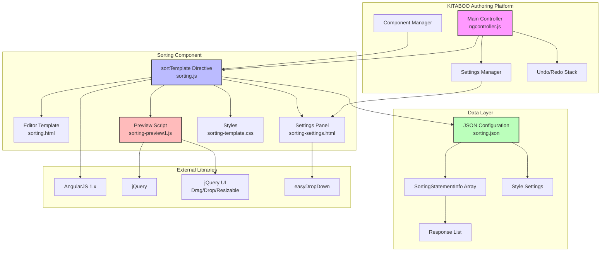

## Editor Mode Data Flow

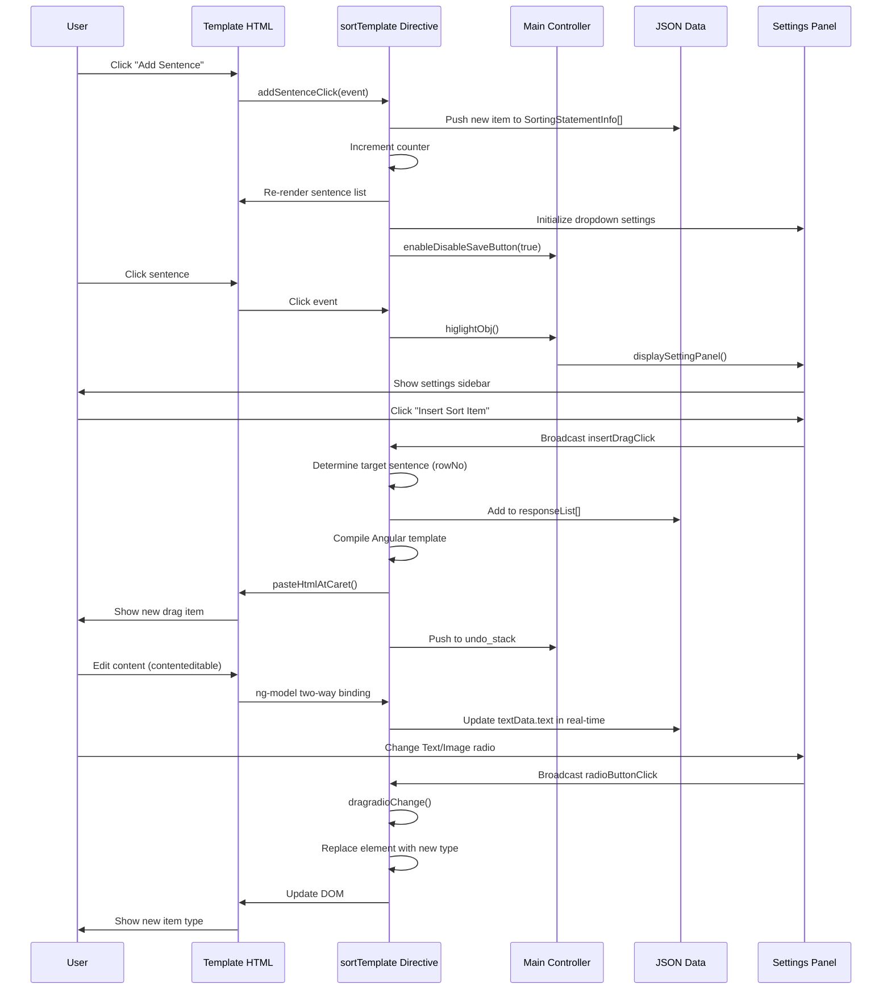

## Preview/Reader Mode Flow

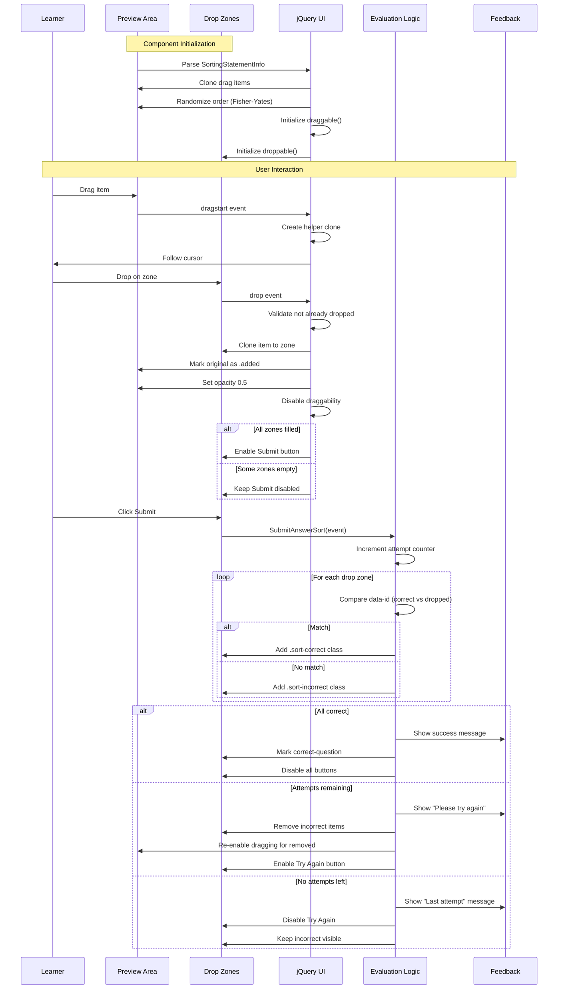

## Component State Machine

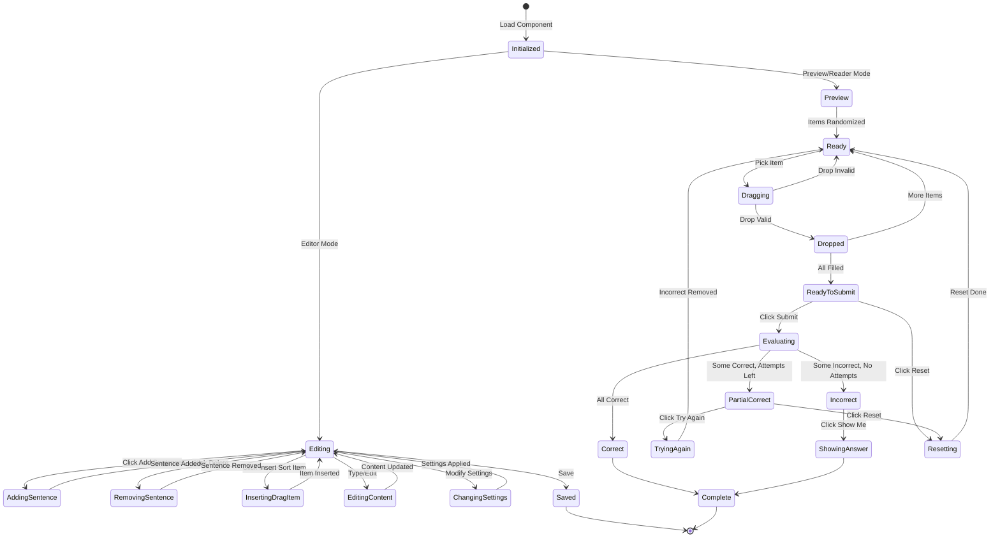

## Evaluation Logic Flow

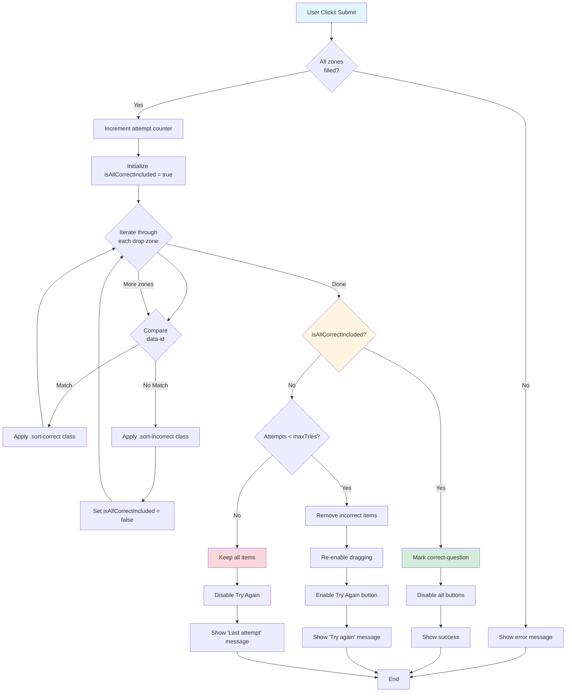

## Data Structure Relationships

```mermaid
erDiagram
    SORTING-COMPONENT ||--|| SETTINGS : contains
    SORTING-COMPONENT ||--|| STYLE : has
    SORTING-COMPONENT ||--|{ SORTING-STATEMENT-INFO : contains
    
    SORTING-STATEMENT-INFO ||--|{ RESPONSE-LIST : has
    RESPONSE-LIST ||--|{ CHOICE-LIST : contains
    CHOICE-LIST ||--|| CHOICE-INFO : wraps
    CHOICE-INFO ||--|| CHOICE : contains
    CHOICE ||--o| TEXT-DATA : has-text
    CHOICE ||--o| MEDIA : has-image
    
    SETTINGS ||--|| STYLE-TAB : references
    STYLE-TAB ||--|{ STYLE-HOLDER : contains
    
    SETTINGS {
        string maxTries
        boolean allowRestart
        boolean showmecheckbox
        boolean isHeaderVisible
        boolean isInstructionVisible
        string isText
        string outline
        string Appearance
    }
    
    SORTING-STATEMENT-INFO {
        string id
        string statement
        string selected
        array responseList
    }
    
    RESPONSE-LIST {
        string responseId
        boolean isTextorImage
        array choiceList
    }
    
    CHOICE {
        string identifier
        object textData
        object media
    }
    
    TEXT-DATA {
        string type
        string text
    }
    
    MEDIA {
        string id
        string src
        string altText
        boolean imageVisible
        object imageSetting
    }
```

## User Interaction Flow

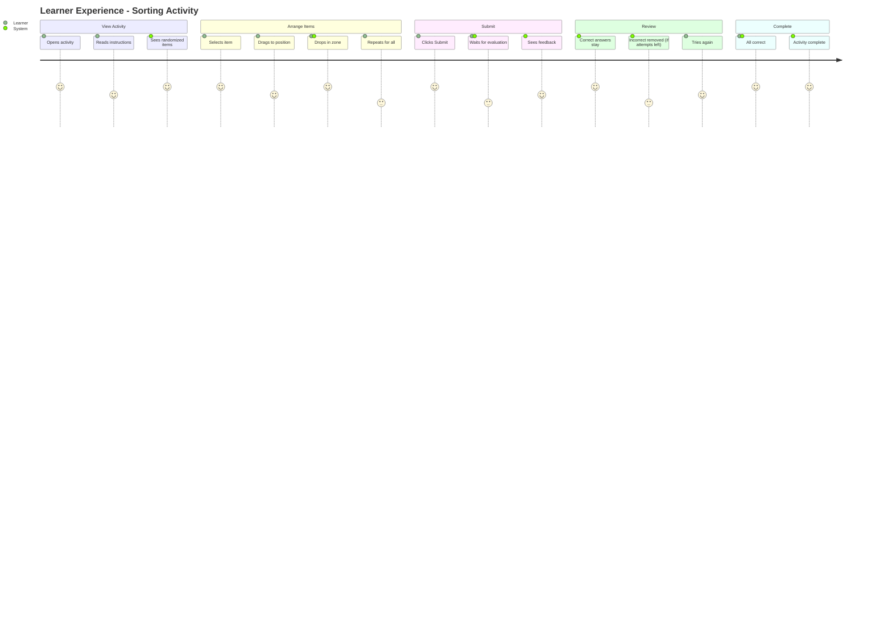

## Component Lifecycle

```mermaid
timeline
    title Sorting Component Lifecycle
    section Creation
      Load default JSON : Component initialized
      Apply to scope : Data bound
      Compile template : Angular directives processed
    section Initialization
      Execute link function : Event handlers attached
      Load blanks : Drag items rendered
      Apply styles : CSS classes applied
      Setup resizable : jQuery UI resizable initialized
    section Editor Mode
      Author adds sentences : Max 5 sentences
      Author inserts drag items : Max 5 per sentence
      Author configures settings : Attempts, buttons, styles
      Author edits content : Real-time JSON updates
    section Save
      Validate data : Check completeness
      Serialize JSON : Convert to string
      Package assets : Include CSS, JS, images
    section Preview/Reader Mode
      Load JSON : Parse configuration
      Initialize UI : Create drag/drop
      Randomize items : Fisher-Yates shuffle
      Enable interaction : jQuery UI active
    section Learner Interaction
      Drag and drop : User arranges items
      Submit answer : Evaluation triggered
      Receive feedback : Visual and text feedback
      Try again/complete : Based on result
    section Completion
      Record score : Calculate percentage
      Save state : LMS integration
      Mark complete : Activity finished
```

## Settings Panel Interaction

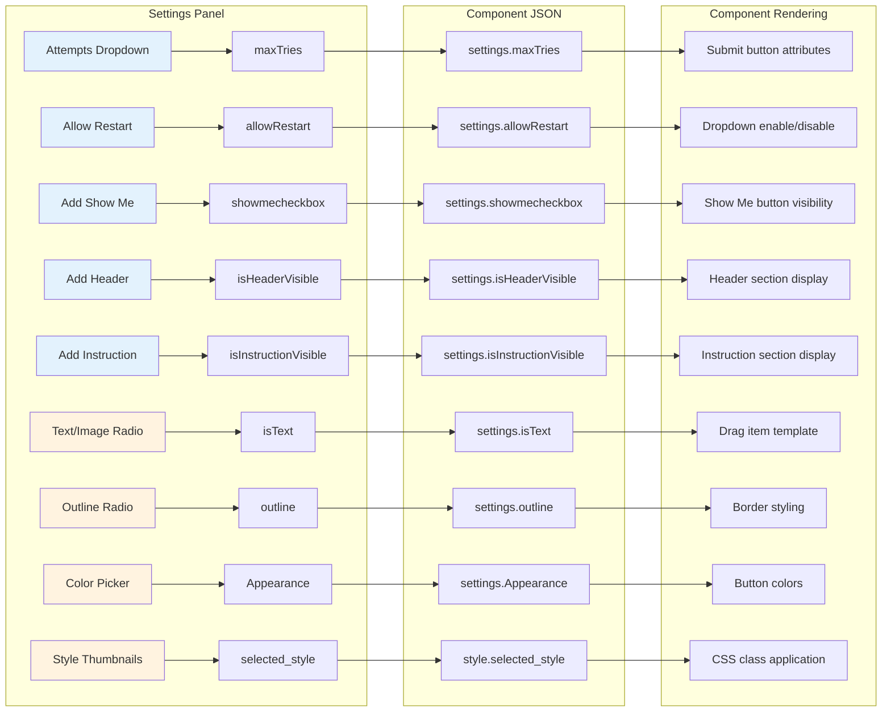

## Drag and Drop Mechanics

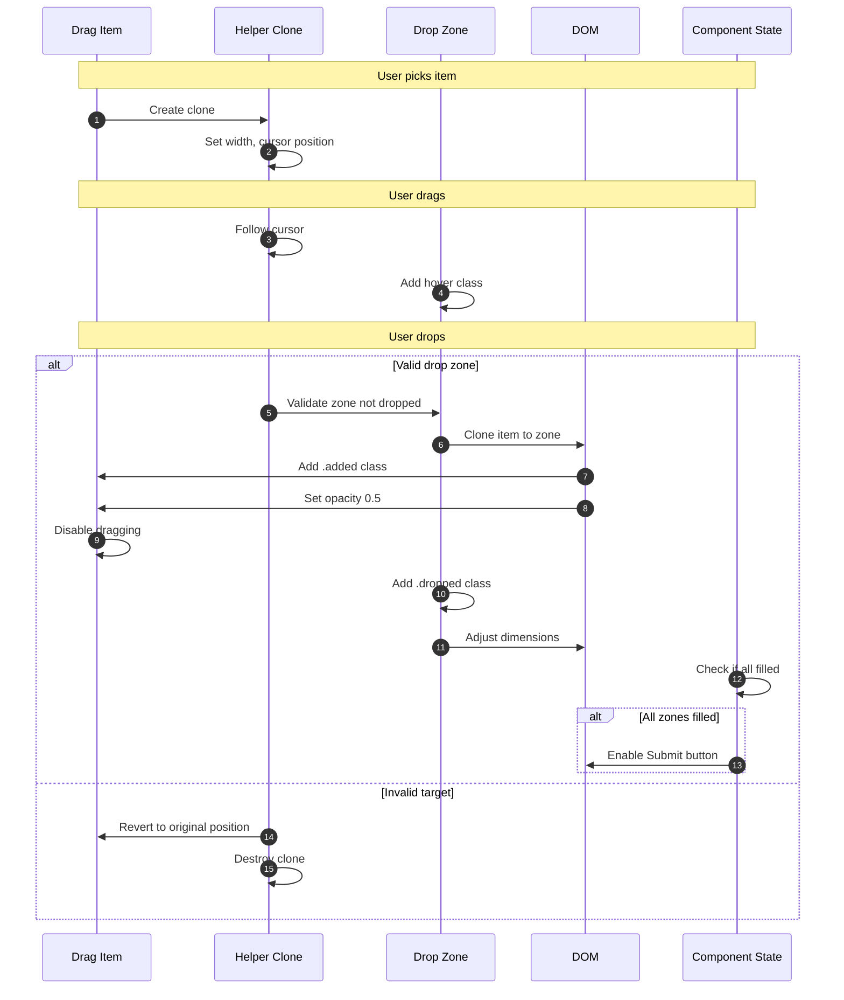

## Style Variant Application

```mermaid
flowchart LR
    A[User clicks style thumbnail] --> B[Applystylesorting called]
    B --> C{Get template scope}
    C --> D[Remove active-style class]
    D --> E{Is Full Bleed?}
    
    E -->|Yes| F[Add full-bleed class to .sd-item]
    E -->|No| G[Skip]
    
    F --> H[Get current style class]
    G --> H
    
    H --> I[Remove old style class from .component-holder]
    I --> J[Get new style class name]
    J --> K[Add new style class]
    K --> L[Update all styleactive flags to false]
    L --> M[Set selected style's styleactive to true]
    M --> N[Add active-style to thumbnail]
    N --> O[Update JSON: fieldData.style.selected_style]
    O --> P[Trigger CSS class reflow]
    P --> Q[Component re-styled]
    
    style A fill:#e1f5ff
    style Q fill:#d4edda
```

## Error Scenarios

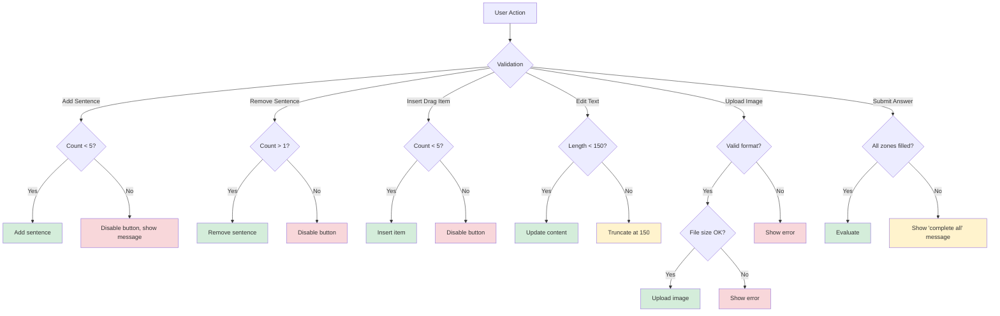

---

## Diagram Legend

### Colors
- 🟦 **Blue**: User interface elements
- 🟩 **Green**: Successful operations
- 🟨 **Yellow**: Warning states
- 🟥 **Red**: Error states
- 🟪 **Purple**: Main controller/orchestrator
- 🟧 **Orange**: Settings/configuration

### Symbols
- ◆ **Diamond**: Decision point
- ▭ **Rectangle**: Process/Action
- ⬭ **Parallelogram**: Input/Output
- ⬮ **Cylinder**: Data storage

---

**Document Version**: 1.0  
**Last Updated**: February 17, 2026  
**Companion to**: TECHNICAL_DOCUMENTATION.md
