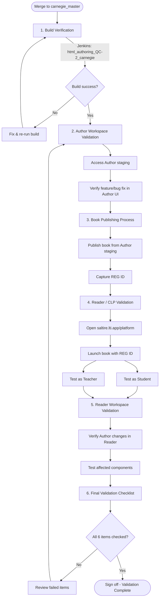

# Post-Merge Staging Validation Guide

**Author & Reader Workspaces | Branch: `carnegie_master`**

This document describes the verification workflow developers must follow after merging code changes into the `carnegie_master` branch and deploying to the staging environment.

---

## Overview

| Workspace | Location | Purpose |
|-----------|----------|---------|
| **Author (Closify)** | closify | Content authoring and book publishing |
| **Reader** | D:\kitaboo-reader-sdk | CLP / Reader experience |

**Main development branch:** `carnegie_master`

**Interactive report:** After deploying Author to staging, open the step-by-step validation report in your browser:  
**https://qapartnerportal.kitaboo.com/Author-Staging-Deployment-Validation-Report.html**  

- **Local:** Open `KITABOO_Authoring/Author-Staging-Deployment-Validation-Report.html` in your browser, or run a local server (e.g. `npx serve .` from `KITABOO_Authoring`) and open `http://localhost:3000/Author-Staging-Deployment-Validation-Report.html`.
- **Commit ID/message:** Filled automatically. Run once from closify root: `node scripts/install-git-hooks.js` — then the report updates after every `git commit`. Or run manually: `npm run inject-report`.
- **Build:** The report is included in `gulp build` output (dist/ and archive.zip); Jenkins build injects the current commit before publishing.

---

## Validation Flow Diagram

The following diagram shows the end-to-end flow of the post-merge staging validation process:

### Steps at a Glance

| Step | Phase | Key action |
|------|--------|------------|
| 1 | Build Verification | Run Jenkins build for `carnegie_master` → confirm SUCCESS |
| 2 | Author Validation | Verify feature/fix on Author staging server |
| 3 | Book Publishing | Publish book from Author staging → save **REG ID** |
| 4 | Reader / CLP | Open CLP → launch book with REG ID as **Student** and **Teacher** |
| 5 | Reader Validation | Confirm Author changes in Reader; test components; check for regressions |
| 6 | Final Checklist | Complete all 6 sign-off items before closing validation |

---

## 1. Build Verification

Verify that the merged code builds successfully in Jenkins.

### Steps

1. Open Jenkins:
   - **URL:** https://jenkins-linux.kitaboo.com/
   - **Job:** `html_authoring_QC-2_carnegie`

2. Run the build for the `carnegie_master` branch.

3. Confirm the build completes with **success** (green status).

### Checklist

- [ ] Jenkins build triggered for `carnegie_master`
- [ ] Build status: **SUCCESS**
- [ ] No build failures or errors in the console output

---

## 2. Author Workspace Validation

Validate that the Author (staging) deployment reflects your changes and the feature or bug fix works as intended.

### Steps

1. Access the **Author staging server** (latest deployment from `carnegie_master`).

2. Log in and navigate to the area affected by your change (feature or bug fix).

3. Perform the same actions that were tested locally:
   - Create/edit content if applicable
   - Use the modified UI or workflow
   - Confirm expected behavior and that no regressions are introduced

### Checklist

- [ ] Author staging shows the latest deployment
- [ ] Implemented feature/bug fix works as expected in the Author interface
- [ ] No unexpected errors in the browser console (check DevTools if needed)

---

## 3. Book Publishing Process

Ensure that a book can be published end-to-end from the Author staging environment.

### Steps

1. In the Author staging platform, open or create a book that uses the changed functionality (if relevant).

2. Start the **publish** flow for the book.

3. Complete the publishing process and wait for it to finish.

4. **Note the REG ID** generated after publishing — you will use it for Reader/CLP validation.

### Checklist

- [ ] Publishing process completes without errors
- [ ] REG ID is generated and saved for the next step

---

## 4. Reader / CLP Validation

Verify that the published book launches correctly on the CLP (Content Learning Platform) for both Student and Teacher roles.

### Steps

1. Open the platform:
   - **URL:** https://saltire.lti.app/platform

2. Use the **REG ID** obtained from the publishing step to locate and launch the book.

3. **Launch as Student:**
   - Open the book as a Student user
   - Navigate through the content and interact with the affected components/features
   - Confirm behavior and layout

4. **Launch as Teacher:**
   - Open the same book as a Teacher user
   - Repeat the same validation for Teacher-specific features and views

### Checklist

- [ ] CLP opens at https://saltire.lti.app/platform
- [ ] Book launches successfully using the REG ID
- [ ] **Student role:** Book opens and affected features work as expected
- [ ] **Teacher role:** Book opens and affected features work as expected

---

## 5. Reader Workspace Validation

Confirm that changes made in the Author workspace are correctly reflected in the Reader (CLP) and that there are no regressions.

### Steps

1. Compare behavior and content in the Reader with what was authored and published:
   - Layout, styling, and structure
   - Interactive components (e.g., activities, templates)
   - Any new or modified functionality

2. Test **affected components/features** in both Student and Teacher contexts.

3. Check for:
   - Correct rendering of new or updated content
   - No broken interactions or missing assets
   - Consistent behavior with Author-side expectations

### Checklist

- [ ] Latest Author changes are correctly reflected in the Reader (CLP)
- [ ] Affected components/features work as expected
- [ ] Functionality verified in **both** Student and Teacher roles
- [ ] No UI or functional regressions observed

---

## 6. Final Validation Checklist

Use this summary checklist before considering staging validation complete.

| # | Item | Status |
|---|------|--------|
| 1 | Build status is **successful** in Jenkins | ☐ |
| 2 | Author-side functionality works correctly on staging | ☐ |
| 3 | Book publishes successfully from Author staging | ☐ |
| 4 | CLP launches properly at https://saltire.lti.app/platform | ☐ |
| 5 | Changes are reflected correctly in the Reader | ☐ |
| 6 | No UI or functionality regressions observed | ☐ |

**All items must be checked before signing off on post-merge staging validation.**

---

## Quick Reference

| Resource | URL / Detail |
|----------|------------------|
| Jenkins | https://jenkins-linux.kitaboo.com/ |
| Jenkins job | `html_authoring_QC-2_carnegie` |
| Branch | `carnegie_master` |
| CLP / Platform | https://saltire.lti.app/platform |
| Author workspace | closify (Author) |
| Reader workspace | D:\kitaboo-reader-sdk |

---

## Troubleshooting

- **Build fails in Jenkins:** Review the Jenkins console log, fix reported errors, and re-run the build after pushing fixes to `carnegie_master`.
- **Author staging not updated:** Confirm deployment from `carnegie_master` has completed and clear browser cache if needed.
- **Publishing fails:** Check Author staging logs and browser console; ensure all required content and configuration are present.
- **Book does not launch on CLP:** Verify REG ID, user roles, and that the book was published successfully; retry with a new publish if necessary.
- **Reader behavior differs from Author:** Re-publish the book after Author changes and validate again with a new REG ID.
